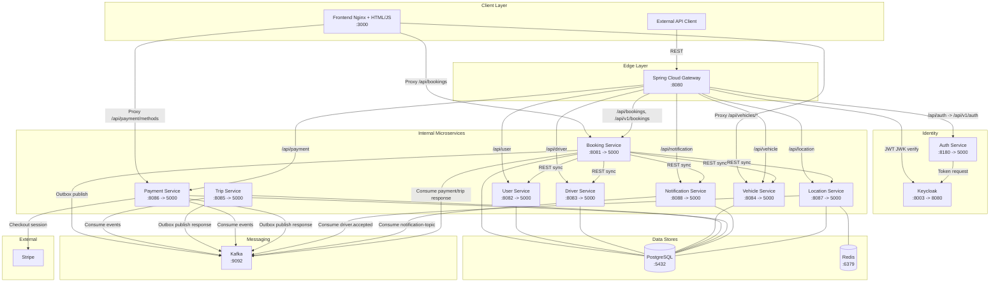

# Project Name

[](https://github.com/hungdn1701/microservices-assignment-starter/stargazers)
[](https://github.com/hungdn1701/microservices-assignment-starter/network/members)
[](LICENSE)

> Brief description of the business process being automated and the service-oriented solution.

> **New to this repo?** See [`GETTING_STARTED.md`](GETTING_STARTED.md) for setup instructions, workflow guide, and submission checklist.

---

## Team Members

| Name               | Student ID | Role   | Contribution                                                                                          |
|--------------------|------------|--------|-------------------------------------------------------------------------------------------------------|
| Nguyễn Khắc Trường | B22DCCN884 | Lead   | vehical-service, trip-service, payment-service, notification-service, driver-service, booking-service |
| Lê Việt Anh        | B22DCCN020 | Member | user-service, location-service, auth-service,  gateway                                                |


---

## Business Process

*(Summarize the business process being automated — domain, actors, scope)*

Hệ thống tự động hóa quy trình **đặt xe và vận chuyển hành khách** trong domain gọi xe công nghệ, với hai tác nhân chính là **Khách hàng** và **Tài xế**. 

---

## Architecture

*(Paste or update the architecture diagram from [`docs/architecture.md`](docs/architecture.md) here.)*



| Component | Responsibility | Tech Stack                            | Port |
|---|---|---------------------------------------|------|
| **Client** | Giao diện Khách hàng và Tài xế | HTML                                  | 3000 |
| **API Gateway** | Single entry point: xác thực JWT với Keycloak, routing vào Internal Network, role-based access control (Customer không gọi driver-endpoint và ngược lại) | Spring Cloud Gateway                  | 8080 |
| **Auth Service** | Xác thực người dùng (POST /auth/login), cấp phát JWT Token với claim `role` (CUSTOMER / DRIVER) | Keycloak                              | 8180 |
| **Booking Task Service** | Saga Orchestrator: điều phối luồng đặt xe, publish/consume Kafka events, xử lý compensating transaction | Spring Boot, PostgreSQL, Kafka        | 8081 |
| **User Service** | GET thông tin Khách hàng (GET /users/{id}) | Spring Boot, PostgreSQL               | 8082 |
| **Driver Service** | GET/UPDATE thông tin Tài xế, cập nhật trạng thái AVAILABLE/ON_TRIP | Spring Boot, PostgreSQL               | 8083 |
| **Vehicle Service** | GET thông tin xe, loại xe và biểu giá cơ bản | Spring Boot, PostgreSQL               | 8084 |
| **Trip Service** | Quản lý vòng đời chuyến đi | Spring Boot, PostgreSQL, Kafka        | 8085 |
| **Payment Service** | Quản lý giao dịch | Spring Boot, PostgreSQL, Kafka        | 8086 |
| **Location Service** | Geospatial query tìm tài xế gần nhất (GEOADD / GEORADIUS) | Spring Boot, PostgreSQL, Redis, Kafka | 8087 |
| **Notification Service** | Nhận và push notification đến Client/Driver qua WebSocket | Spring Boot, PostgreSQL               | 8088 |
| **Apache Kafka** | Message broker bền vững cho Saga async events và Outbox relay | Apache Kafka + Zookeeper              | 9092 |
| **PostgreSQL** | Relational DB — mỗi service có schema riêng | PostgreSQL                            | 5432 |
| **Redis** | Geospatial store riêng cho Location Service (GEOADD / GEORADIUS) | Redis                                 | 6379 |
 
---

## Quick Start

```bash
docker compose up --build
```

Verify: `curl http://localhost:8080/health`

> For full setup instructions, prerequisites, and development commands, see [`GETTING_STARTED.md`](GETTING_STARTED.md).

---

## Documentation

| Document | Description |
|----------|-------------|
| [`GETTING_STARTED.md`](GETTING_STARTED.md) | Setup, workflow, submission checklist |
| [`docs/analysis-and-design.md`](docs/analysis-and-design.md) | Analysis & Design — Step-by-Step Action approach |
| [`docs/analysis-and-design-ddd.md`](docs/analysis-and-design-ddd.md) | Analysis & Design — Domain-Driven Design approach |
| [`docs/architecture.md`](docs/architecture.md) | Architecture patterns, components & deployment |
| [`docs/api-specs/`](docs/api-specs/) | OpenAPI 3.0 specifications for each service |

---

## License

This project uses the [MIT License](LICENSE).

> Template by [Hung Dang](https://github.com/hungdn1701) · [Template guide](GETTING_STARTED.md)

