# Analysis and Design — Business Process Automation Solution

> **Goal**: Analyze a specific business process and design a service-oriented automation solution (SOA/Microservices).
> Scope: 4–6 week assignment — focus on **one business process**, not an entire system.

**References:**
1. *Service-Oriented Architecture: Analysis and Design for Services and Microservices* — Thomas Erl (2nd Edition)
2. *Microservices Patterns: With Examples in Java* — Chris Richardson
3. *Bài tập — Phát triển phần mềm hướng dịch vụ* — Hung Dang (available in Vietnamese)

## Part 1 — Analysis Preparation

### 1.1 Business Process Definition

Describe or diagram the high-level Business Process to be automated.

- **Domain**: Hệ thống vận chuyển hành khách
- **Business Process**: Quy trình đặt xe và vận chuyển
- **Actors**: Khách hàng, Tài xế
- **Scope**: (Khách hàng) Đăng nhập và xác thực, chọn điểm đón/trả, chọn xe, ước tính tiền, chọn phương thức thanh toán, tìm tài xế gần nhất, đánh dấu trạng thái tài xế, đánh dấu trạng thái chuyến đi, thanh toán. (Tài xế) Đăng nhập và xác thực, nhận thông báo chuyến mới, chấp nhận hoặc từ chối chuyến, bắt đầu chuyến đi, hoàn thành chuyến đi.

**Process Diagram:**

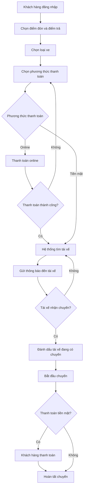

### 1.2 Existing Automation Systems

List existing systems, databases, or legacy logic related to this process.

None — the process is currently performed manually.

> If none exist, state: *"None — the process is currently performed manually."*

### 1.3 Non-Functional Requirements

Non-functional requirements serve as input for identifying Utility Service and Microservice Candidates in step 2.7.

| Requirement    | Description |
|----------------|-------------|
| Performance    | Tìm tài xế gần nhất < 10 giây. Notification đến tài xế < 2 giây.             |
| Security       | Role-based: customer không gọi được driver-endpoint và ngược lại.             |

---

## Part 2 — REST/Microservices Modeling

### 2.1 Event Storming — Domain Events

List Domain Events in chronological order as they occur in the business process.
Format: past tense (e.g., "OrderPlaced", "PaymentReceived").

| # | Domain Event | Triggered By | Description |
|---|-------------|--------------|-------------|
| 1 | UserAuthenticated | Auth Service | Khách hàng hoặc tài xế đăng nhập thành công và nhận JWT. |
| 2 | FareEstimated | Booking Task Service | Hệ thống tính khoảng cách chim bay và giá ước tính cho loại xe đã chọn. |
| 3 | BookingCreated | Booking Task Service | Yêu cầu đặt xe hợp lệ, booking được tạo với trạng thái ban đầu. |
| 4 | PaymentInitiated | Payment Service | Giao dịch thanh toán được tạo ở trạng thái `PENDING`. |
| 5 | OnlinePaymentSucceeded | Payment Service | Thanh toán online thành công (chỉ với payment method ONLINE). |
| 6 | OnlinePaymentFailed | Payment Service | Thanh toán online thất bại, booking không chuyển sang tìm tài xế. |
| 7 | DriverSearchRequested | Booking Task Service | Booking đủ điều kiện tìm tài xế (CASH hoặc ONLINE đã thành công). |
| 8 | DriverFound | Location Service | Tìm thấy tài xế phù hợp gần điểm đón. |
| 9 | DriverNotified | Notification Service | Tài xế được gửi thông báo có cuốc mới. |
| 10 | DriverAccepted | Booking Task Service | Tài xế chấp nhận cuốc, booking/trip chuyển sang trạng thái ACCEPTED. |
| 11 | DriverRejected | Booking Task Service | Tài xế từ chối cuốc, hệ thống quay lại tìm tài xế khác. |
| 12 | TripStarted | Booking Task Service | Tài xế bắt đầu chuyến đi. |
| 13 | TripCompleted | Booking Task Service | Tài xế hoàn tất chuyến đi. |
| 14 | CashPaymentCompleted | Payment Service | Thanh toán tiền mặt được đánh dấu hoàn tất sau khi trip completed. |
| 15 | BookingCancelled | Booking Task Service | Khách hàng hủy cuốc khi còn hợp lệ hủy. |

### 2.2 Commands and Actors

What Commands trigger those Domain Events, and who issues them?

| Command | Actor | Triggers Event(s) |
|---------|-------|--------------------|
| `Login` | Khách hàng / Tài xế | `UserAuthenticated` |
| `GetEstimate` | Khách hàng | `FareEstimated` |
| `CreateBooking` | Khách hàng | `BookingCreated`, `PaymentInitiated` |
| `ConfirmOnlinePayment` | Payment Gateway / Payment Service | `OnlinePaymentSucceeded` hoặc `OnlinePaymentFailed` |
| `RequestDriverSearch` | Booking Task Service | `DriverSearchRequested` |
| `FindNearbyDriver` | Booking Task Service | `DriverFound` |
| `SendTripNotificationToDriver` | Booking Task Service | `DriverNotified` |
| `AcceptBooking` | Tài xế | `DriverAccepted` |
| `RejectBooking` | Tài xế | `DriverRejected` |
| `StartTrip` | Tài xế | `TripStarted` |
| `CompleteTrip` | Tài xế | `TripCompleted` |
| `CompleteCashPayment` | Booking Task Service | `CashPaymentCompleted` |
| `CancelBooking` | Khách hàng | `BookingCancelled` |
| `SetDriverAvailable` | Booking Task Service | `DriverBecameAvailable` |

### 2.3 Entity Service Candidates

Identify business entities and group reusable (agnostic) actions into Entity Service Candidates.

| Entity | Service Candidate | Agnostic Capabilities (Reusable across processes) |
| :--- | :--- | :--- |
| User | User Service | Truy xuất thông tin (profile) khách hàng. |
| Driver | Driver Service | Truy xuất thông tin (profile) tài xế; Cập nhật trạng thái hoạt động của tài xế (rảnh/bận). |
| Vehicle / Vehicle Type | Vehicle Service | Truy xuất thông tin chi tiết phương tiện; Truy xuất thông tin loại hình xe; Truy xuất biểu giá cơ bản theo loại xe. |
| Trip | Trip Service | Tạo bản ghi chuyến đi; Cập nhật trạng thái chuyến đi (started/completed/cancelled); Truy xuất thông tin chuyến đi. |
| Payment | Payment Service | Tạo mới bản ghi giao dịch; Cập nhật trạng thái giao dịch (pending/paid/failed); Truy xuất thông tin giao dịch. |

### 2.4 Task Service Candidate

Group process-specific (non-agnostic) actions into a Task Service Candidate.

| Non-agnostic Action | Task Service Candidate |
|---------------------|------------------------|
| Ước tính giá tiền chuyến đi; Tìm tài xế phù hợp; Điều phối thông báo về chuyến đi cho khách và tài xế; Xử lý logic tài xế từ chối/chấp nhận; Kích hoạt chuyển đổi trạng thái chuyến đi. Điều phối trạng thái chuyến đi dựa trên kết quả payment                     |Booking Task Service (orchestrator)                       |

### 2.5 Identify Resources

Map entities/processes to REST URI Resources.

| Entity / Process | Resource URI |
|------------------|-------------|
| User             | /users/ |
| Driver           | /drivers/ |
| Vehicle          | /vehicles/ |
| Vehicle Type     | /vehicle-types/ |
| Trip             | /trips/ |
| Payment          | /payments/ |
| Booking Process  | /bookings |


### 2.6 Associate Capabilities with Resources and Methods

| Service Candidate | Capability                                     | Resource                  | HTTP Method |
| :--- |:-----------------------------------------------|:--------------------------|:------------|
| **Auth Service** | Xác thực người dùng và cấp JWT Token           | `/auth/login`             | POST        |
| **User Service** | Lấy thông tin profile khách hàng               | `/users/{id}`             | GET         |
| **Driver Service** | Lấy thông tin profile tài xế                   | `/drivers/{id}`           | GET         |
| **Vehicle Service** | Lấy thông tin chi tiết phương tiện             | `/vehicles/{id}`          | GET         |
| **Vehicle Service** | Lấy thông tin loại xe và biểu giá              | `/vehicle-types`          | GET         |
| **Location Service** | Tìm danh sách tài xế rảnh gần nhất             | `/locations/nearby`       | GET         |
| **Location Service** | Đánh dấu tài xế bận                            | `/locations`              | PATCH       |
| **Payment Service** | Lấy danh sách phương thức thanh toán           | `/payments/methods`       | GET         |
| **Payment Service** | Tạo thanh toán mới                             | `/payments`               | POST        |
| **Payment Service** | Cập nhật thanh toán                            | `/payments/{id}`          | PATCH       |
| **Trip Service** | Tạo bản ghi chuyến đi mới                      | `/trips`                  | POST        |
| **Trip Service** | Cập nhật trạng thái & thời gian chuyến đi      | `/trips/{id}`             | PATCH       |
| **Trip Service** | Lấy thông tin chuyến đi                        | `/trips/{id}`             | GET         |
| **Notification Service**| Gửi thông báo (Push Notification) đến thiết bị | `/notifications`          | POST        |
| **Booking Task Service**| Ước tính giá tiền dựa trên tọa độ và loại xe   | `/bookings/estimate`      | GET         |
| **Booking Task Service**| Nhận yêu cầu đặt xe                            | `/bookings`               | POST        |
| **Booking Task Service**| Xử lý logic vòng đời: Tài xế nhận chuyến       | `/bookings/{id}/accept`   | POST        |
| **Booking Task Service**| Xử lý logic vòng đời: Bắt đầu chuyến đi        | `/bookings/{id}/start`    | POST        |
| **Booking Task Service**| Xử lý logic vòng đời: Hoàn thành chuyến đi     | `/bookings/{id}/complete` | POST        |

### 2.7 Utility Service & Microservice Candidates

Based on Non-Functional Requirements (1.3) and Processing Requirements, identify cross-cutting utility logic or logic requiring high autonomy/performance.

| Candidate             | Type (Utility / Microservice) | Justification                                                                 |
|----------------------|-------------------------------|-------------------------------------------------------------------------------|
| API Gateway         | Utility Service               | Đóng vai trò Single Entry Point. Định tuyến request (Routing) và kiểm tra tính hợp lệ của JWT Token (Authorization) trước khi cho phép truy cập vào các service nghiệp vụ nội bộ. |
| Auth Service         | Utility Service               | Chịu trách nhiệm xác thực thông tin đăng nhập, sinh (cấp phát) JWT Token. Tách riêng để giảm tải logic bảo mật cho các service nghiệp vụ. |
| Notification Service | Utility Service               | WebSocket (Performance NFR). Có thể dùng chung cho mọi quy trình. |
| Location Service     | Microservice                 | Cần hiệu năng truy vấn cao (Geospatial query trên Redis) để tìm tài xế < 10s (Performance NFR). Tách riêng để dễ scale. |


### 2.8 Service Composition Candidates

Interaction diagram showing how Service Candidates collaborate to fulfill the business process.

![Service Composition Candidate]

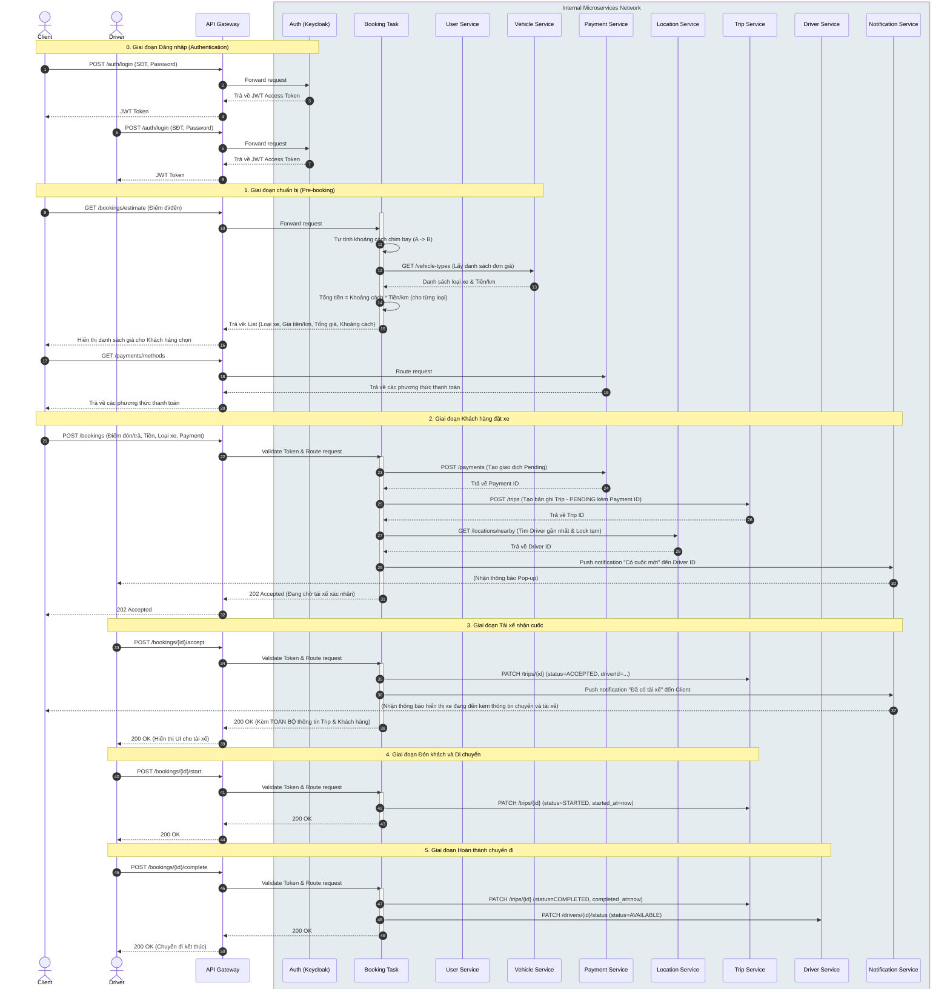

---

## Part 3 — Service-Oriented Design

> Part 3 is the **convergence point** — regardless of whether you used Step-by-Step Action or DDD in Part 2, the outputs here are the same: service contracts and service logic.

### 3.1 Uniform Contract Design

Service Contract specification for each service. Full OpenAPI specs:
- [`docs/api-specs/service-a.yaml`](api-specs/service-a.yaml)
- [`docs/api-specs/service-b.yaml`](api-specs/service-b.yaml)

> 💡 **Derive from Part 2:** Each service capability from 2.6 maps to one API endpoint. Update the OpenAPI spec files to match.

**Service 1 — Auth Service:**

| Endpoint | Method | Description | Request Body | Response Codes |
|----------|--------|-------------|--------------|----------------|
| `/auth/login` | POST | Xác thực người dùng (Client/Driver) và cấp phát JWT Token. | `{ "phone": "string", "password": "string" }` | `200 OK`, `401 Unauthorized` |

**Service 2 — User Service:**

| Endpoint | Method | Description | Request Body | Response Codes |
|----------|--------|-------------|--------------|----------------|
| `/users/{id}` | GET | Truy xuất thông tin cá nhân của khách hàng. | N/A | `200 OK`, `404 Not Found` |

**Service 3 — Driver Service:**

| Endpoint | Method | Description | Request Body | Response Codes |
|----------|--------|-------------|--------------|----------------|
| `/drivers/{id}` | GET | Truy xuất thông tin hồ sơ của tài xế. | N/A | `200 OK`, `404 Not Found` |

**Service 4 — Vehicle Service:**

| Endpoint | Method | Description | Request Body | Response Codes |
|----------|--------|-------------|--------------|----------------|
| `/vehicles/{id}` | GET | Lấy thông tin chi tiết một chiếc xe (biển số, màu sắc). | N/A | `200 OK`, `404 Not Found` |
| `/vehicle-types` | GET | Lấy danh sách các loại hình xe và biểu giá cơ bản. | N/A | `200 OK` |

**Service 5 — Location Service:**

| Endpoint | Method | Description | Request Body                                           | Response Codes |
|----------|--------|-------------|--------------------------------------------------------|----------------|
| `/locations/nearby`| GET | Tìm tài xế rảnh gần nhất dựa trên tọa độ và loại xe. | N/A (Dùng Query params: `lat`, `lng`, `vehicleTypeId`) | `200 OK`, `404 Not Found` |
| `/locations` | POST | Cập nhật trạng thái của tài xế | `{ "driverId": "string", "status" : "string" }`         | `200 OK`, `400 Bad Request` |

---

**Service 6 — Payment Service:**

| Endpoint | Method | Description | Request Body                                                                            | Response Codes |
|----------|--------|-------------|-----------------------------------------------------------------------------------------|----------------|
| `/payments/methods`| GET | Lấy danh sách phương thức thanh toán hỗ trợ. | N/A                                                                                     | `200 OK` |
| `/payments` | POST | Tạo mới một giao dịch thanh toán (PENDING). | `{ "customerId": "string", "amount": number, "method": "string" }` | `201 Created`, `400 Bad Request` |
| `/payments/{id}` | PATCH | Cập nhật trạng thái giao dịch (PAID/FAILED). | `{ "status": "string", "gatewayTransactionId": "string" }`                              | `200 OK`, `400 Bad Request`, `404 Not Found`, `409 Conflict` |

**Service 7 — Trip Service:**

| Endpoint | Method | Description | Request Body                                                                                                                                                 | Response Codes |
|----------|--------|-------------|--------------------------------------------------------------------------------------------------------------------------------------------------------------|----------------|
| `/trips` | POST | Tạo mới một bản ghi chuyến đi. | `{ "paymentId": "string", "pickup_location": "{}", "dropoff_location": "{}", "price": number, "vehicleTypeId": "string", , "userId" : "string" }`                                 | `201 Created`, `400 Bad Request` |
| `/trips/{id}` | PATCH | Cập nhật chuyến đi. | `{ "status": "string", "driverId": "string", "accepted_at": "timestamp", "started_at": "timestamp", "completed_at": "timestamp", "cancel_at": "timestamp" }` | `200 OK`, `409 Conflict` |

**Service 8 — Notification Service:**

| Endpoint | Method | Description | Request Body | Response Codes |
|----------|--------|-------------|--------------|----------------|
| `/notifications` | POST | Đẩy thông báo (Push notification) đến thiết bị Client/Driver. | `{ "targetId": "string", "targetType": "string", "title": "string", "body": "string", "data": {} }`| `200 OK`, `400 Bad Request` |

**Service 9 — Booking Task Service (Orchestrator):**

| Endpoint | Method | Description | Request Body                                                                            | Response Codes |
|----------|--------|-------------|-----------------------------------------------------------------------------------------|----------------|
| `/bookings/estimate` | GET | Ước tính khoảng cách chim bay và giá cho từng loại xe. | N/A (Query Params: `latA`, `lngA`, `latB`, `lngB`)                                      | `200 OK`, `400 Bad Request` |
| `/bookings` | POST | Khách hàng gửi yêu cầu đặt xe, khởi tạo luồng tìm kiếm. | `{ "pickup": {}, "dropoff": {}, "vehicleTypeId": "string", "paymentMethod": "string", "userId" : "string" }` | `202 Accepted`, `400 Bad Request` |
| `/bookings/{id}/accept`| POST | Tài xế nhận cuốc, báo Notification về cho khách hàng. | `{ "driverId": "string" }`                                                              | `200 OK`, `409 Conflict` |
| `/bookings/{id}/start` | POST | Đánh dấu bắt đầu hành trình. | `{ "driverId": "string" }`                                                              | `200 OK` |
| `/bookings/{id}/complete`| POST| Hoàn tất hành trình và giải phóng tài xế. | `{ "driverId": "string" }`                                                              | `200 OK` |
| `/bookings/{id}/cancel`| POST| Hủy hành trình. | `{ "cancelReason": "string" }`                                                          | `200 OK` |

### 3.2 Service Logic Design

Internal processing flow for each service, based on Thomas Erl's SOA principles.

---

#### Service 1 — Auth Service *(Utility Service)*

> **Principles:** *Service Abstraction* — hides all authentication logic (password hashing, JWT signing). *Service Reusability* — shared by both Customer and Driver workflows.

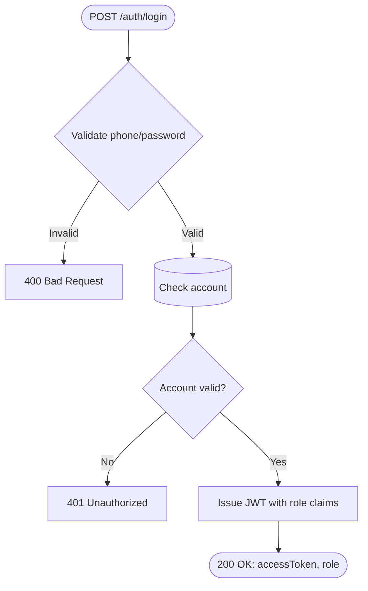

---

#### Service 2 — User Service *(Entity Service)*

> **Principles:** *Service Autonomy* — owns its own User data store. *Agnostic Logic* — pure CRUD on User entity, reusable across any process.

```mermaid
flowchart TD
    A([GET /users/{id}]) --> B{Validate id}
    B -->|Invalid| E1[400 Bad Request]
    B -->|Valid| C[(Find user by id)]
    C --> D{Found?}
    D -->|No| E2[404 Not Found]
    D -->|Yes| E([200 OK: user profile])
```

---

#### Service 3 — Driver Service *(Entity Service)*


---

#### Service 4 — Vehicle Service *(Entity Service)*

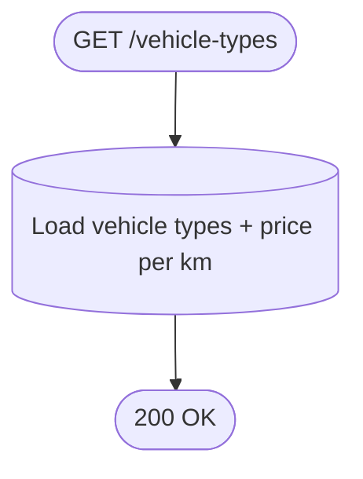

```mermaid
flowchart TD
    A([GET /vehicles/{id}]) --> B{Validate id}
    B -->|Invalid| E1[400 Bad Request]
    B -->|Valid| C[(Find vehicle)]
    C --> D{Found?}
    D -->|No| E2[404 Not Found]
    D -->|Yes| E([200 OK: vehicle detail])
```

#### Service 5 — Location Service *(Microservice)*

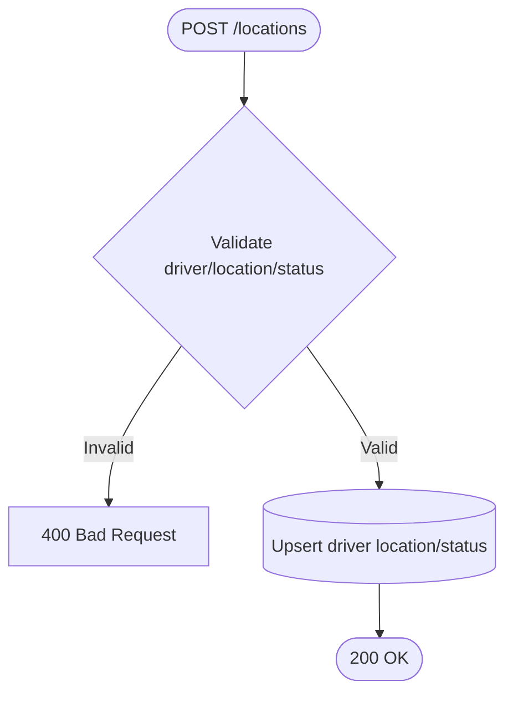

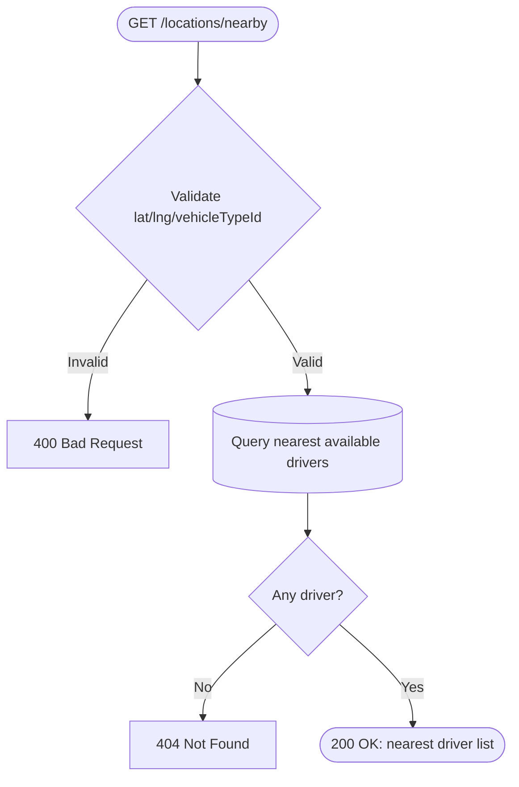

#### Service 6 — Payment Service *(Entity Service)*

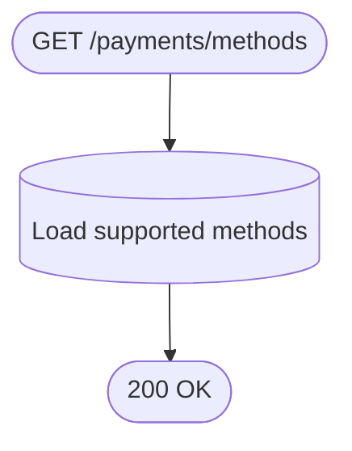

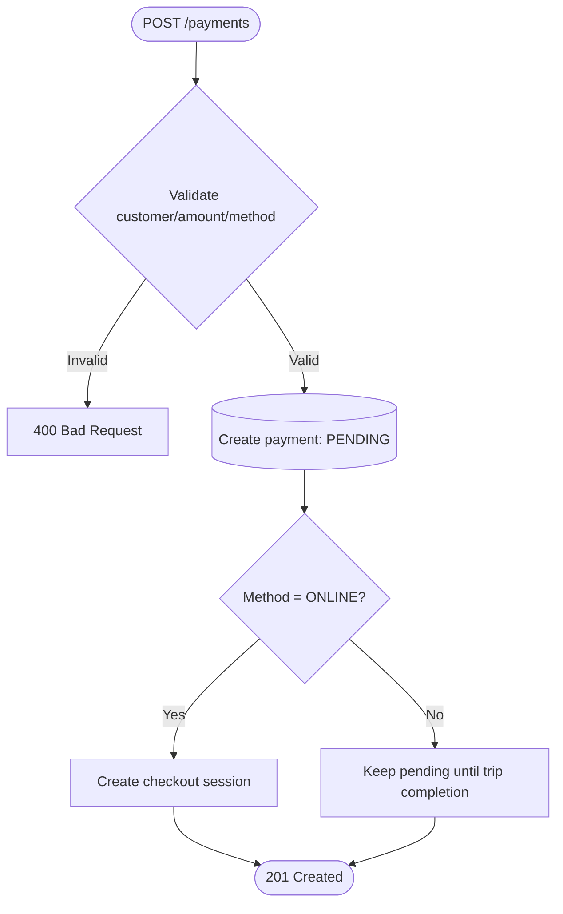

```mermaid
flowchart TD
    A([PATCH /payments/{id}]) --> B{Validate status update}
    B -->|Invalid| E1[400 Bad Request]
    B -->|Valid| C[(Find payment)]
    C --> D{Found?}
    D -->|No| E2[404 Not Found]
    D -->|Yes| E[(Update payment status)]
    E --> F([200 OK])
```

#### Service 7 — Trip Service *(Entity Service)*

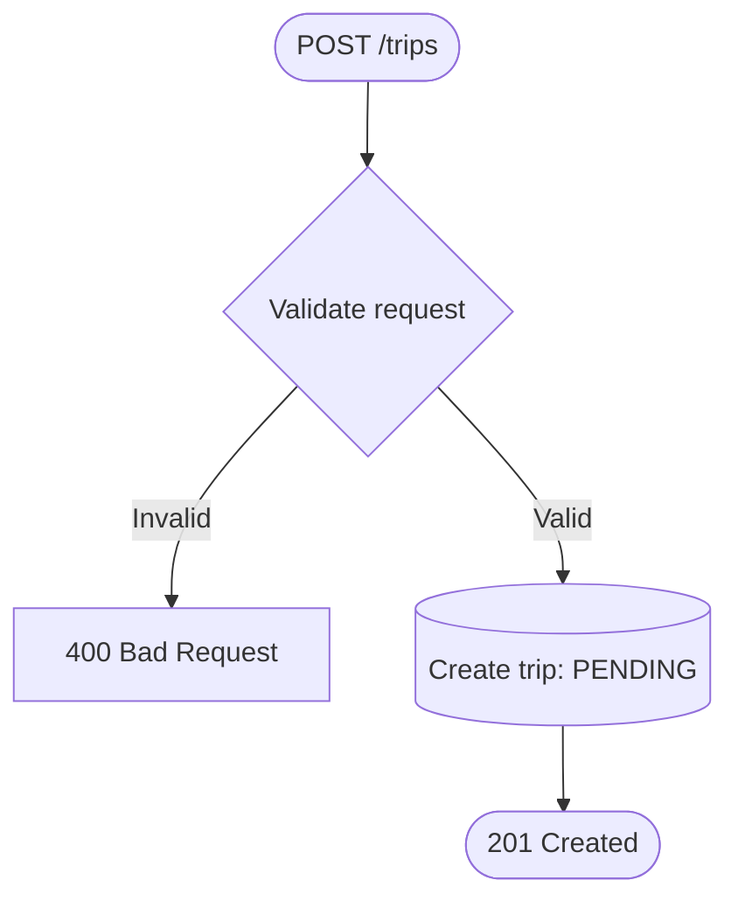

```mermaid
flowchart TD
    A([PATCH /trips/{id}]) --> B{Validate transition}
    B -->|Invalid| E1[400/409]
    B -->|Valid| C[(Find trip and apply state change)]
    C --> D([200 OK])
```

#### Service 8 — Notification Service *(Utility Service)*

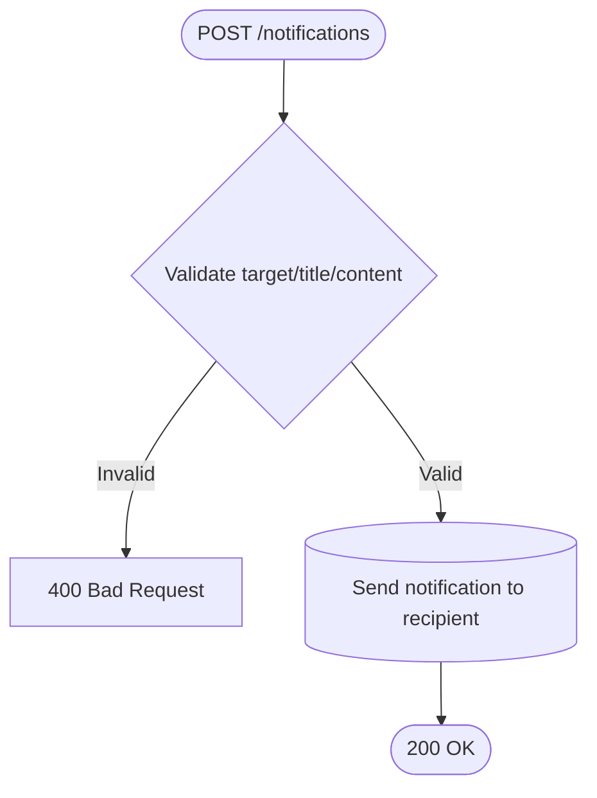

#### Service 9 — Booking Task Service *(Orchestrator)*

> Logic dưới đây bám theo luồng nghiệp vụ chuẩn ở phần trên; triển khai thực tế có thể dùng REST + event (Kafka/outbox) nhưng không thay đổi ý nghĩa nghiệp vụ.

**GET `/bookings/estimate`**

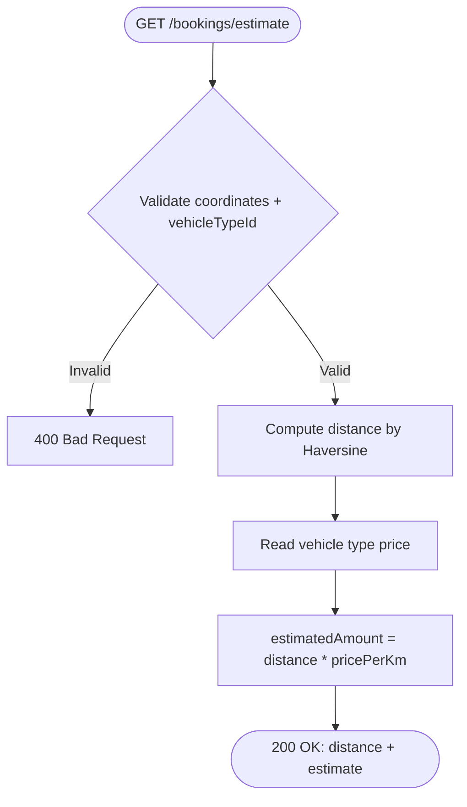

**POST `/bookings`**

```mermaid
flowchart TD
    A([POST /bookings]) --> B{Validate input + CUSTOMER role}
    B -->|Invalid| E1[400/401]
    B -->|Valid| C[Load user + vehicle type]
    C --> D[Create booking with status by payment method]
    D --> E[Publish/create Trip]
    E --> F[Publish/create Payment]
    F --> G{ONLINE?}
    G -->|Yes| H[Wait payment response (checkoutUrl)]
    G -->|No| I[Move to finding-driver flow]
    H --> J([202 Accepted])
    I --> J
```

**POST `/bookings/{id}/accept`**

```mermaid
flowchart TD
    A([POST /bookings/{id}/accept]) --> B{Validate DRIVER role + driverId}
    B -->|Invalid| E1[400/401]
    B -->|Valid| C[(Load booking + driver + vehicle)]
    C --> D[Assign driver to booking]
    D --> E[Publish Trip ACCEPTED update]
    E --> F[Notify customer]
    F --> G([200 OK])
```

**POST `/bookings/{id}/start`**

```mermaid
flowchart TD
    A([POST /bookings/{id}/start]) --> B{Validate DRIVER role + driverId}
    B -->|Invalid| E1[400/401]
    B -->|Valid| C[Publish Trip STARTED update]
    C --> D([200 OK])
```

**POST `/bookings/{id}/complete`**

```mermaid
flowchart TD
    A([POST /bookings/{id}/complete]) --> B{Validate DRIVER role + driverId}
    B -->|Invalid| E1[400/401]
    B -->|Valid| C[Publish Trip COMPLETED update]
    C --> D{Payment method = CASH?}
    D -->|Yes| E[Publish payment completed]
    D -->|No| F[Skip]
    E --> G([200 OK])
    F --> G
```

**POST `/bookings/{id}/cancel`**

```mermaid
flowchart TD
    A([POST /bookings/{id}/cancel]) --> B{Validate owner + cancellable state}
    B -->|Invalid| E1[400/403/409]
    B -->|Valid| C[Set booking canceled]
    C --> D[Publish Trip CANCELLED update]
    D --> E([200 OK])
```
