# Analysis and Design — Business Process Automation Solution

> **Goal**: Analyze a specific business process and design a service-oriented automation solution (SOA/Microservices).
> Scope: 4–6 week assignment — focus on **one business process**, not an entire system.

**References:**
1. *Service-Oriented Architecture: Analysis and Design for Services and Microservices* — Thomas Erl (2nd Edition)
2. *Microservices Patterns: With Examples in Java* — Chris Richardson
3. *Bài tập — Phát triển phần mềm hướng dịch vụ* — Hung Dang (available in Vietnamese)

---

## Part 1 — Analysis Preparation

### 1.1 Business Process Definition

Describe or diagram the high-level Business Process to be automated.

- **Domain**: Hệ thống vận chuyển hành khách
- **Business Process**: Quy trình đặt xe và vận chuyển
- **Actors**: Khách hàng, Tài xế
- **Scope**: Đăng nhập và xác thực, chọn điểm đón/trả, chọn xe, ước tính tiền, chọn phương thức thanh toán, tìm tài xế gần nhất, đánh dấu trạng thái tài xế, đánh dấu trạng thái chuyến đi, thanh toán.

**Process Diagram:**

### 1.2 Existing Automation Systems

List existing systems, databases, or legacy logic related to this process.

None — the process is currently performed manually.

> If none exist, state: *"None — the process is currently performed manually."*

### 1.3 Non-Functional Requirements

Non-functional requirements serve as input for identifying Utility Service and Microservice Candidates in step 2.7.

| Requirement    | Description |
|----------------|-------------|
| Performance    | Tìm tài xế gần nhất < 10 giây. Notification đến tài xế < 2 giây.             |
| Security       | Role-based: customer không gọi được driver-endpoint và ngược lại.             |

---

## Part 2 — REST/Microservices Modeling

### 2.1 Decompose Business Process & 2.2 Filter Unsuitable Actions

Decompose the process from 1.1 into granular actions. Mark actions unsuitable for service encapsulation.

| #  | Action                               | Actor                   | Description                                                                 | Suitable? |
|----|--------------------------------------|------------------------|-----------------------------------------------------------------------------|-----------|
| 1  | Đăng nhập hệ thống                   | Khách hàng             | Xác thực danh tính, cấp JWT token                                          | ✅        |
| 2  | Chọn điểm đón                        | Khách hàng             | Nhập/chọn địa chỉ điểm đón                                     | ✅        |
| 3  | Chọn điểm trả                        | Khách hàng             | Nhập/chọn địa chỉ điểm trả                                     | ✅        |
| 4  | Chọn loại xe                         | Khách hàng             | Chọn loại xe (4 chỗ, 7 chỗ...) và xem giá ước tính                         | ✅        |
| 5  | Chọn phương thức thanh toán          | Khách hàng             | Chọn thanh toán online hoặc tiền mặt                                       | ✅        |
| 6  | Thực hiện thanh toán online          | Hệ thống / Khách hàng  | Tạo giao dịch, gọi Payment Gateway xử lý trước chuyến                      | ✅        |
| 7  | Xử lý thanh toán thất bại            | Hệ thống               | Thông báo thất bại, cho phép quay lại chọn phương thức                     | ✅        |
| 8  | Tìm tài xế phù hợp                   | Hệ thống               | Truy vấn Location Service lấy danh sách tài xế online gần điểm đón         | ✅        |
| 9  | Gửi thông báo chuyến đến tài xế      | Hệ thống               | Push notification qua WebSocket/FCM đến tài xế, chờ phản hồi              | ✅        |
| 10 | Tài xế từ chối / timeout             | Tài xế                 | Ghi nhận từ chối, hệ thống chuyển sang tài xế tiếp theo                   | ✅        |
| 11 | Tài xế chấp nhận chuyến              | Tài xế                 | Tài xế xác nhận nhận chuyến qua app                                       | ✅        |
| 12 | Cập nhật trạng thái tài xế thành bận | Hệ thống               | Đánh dấu on_trip, loại khỏi pool tìm kiếm                                 | ✅        |
| 13 | Bắt đầu chuyến đi                    | Hệ thống               | Ghi nhận thời điểm bắt đầu                     | ✅        |
| 14 | Thông báo kết quả đến khách hàng     | Hệ thống               | Push thông tin tài xế & xe đến khách qua WebSocket/FCM                    | ✅        |
| 15 | Thanh toán tiền mặt sau chuyến       | Khách hàng / Tài xế    | Trao đổi tiền mặt trực tiếp — không qua hệ thống                          | ❌        |
| 16 | Hoàn tất chuyến đi                   | Hệ thống               | Cập nhật trạng thái trip = completed                                      | ✅        |
| 17 | Cập nhật trạng thái tài xế về rảnh   | Hệ thống               | Đánh dấu available, sẵn sàng nhận chuyến mới                              | ✅        |
> Actions marked ❌: manual-only, require human judgment, or cannot be encapsulated as a service.

### 2.3 Entity Service Candidates

Identify business entities and group reusable (agnostic) actions into Entity Service Candidates.

| Entity | Service Candidate | Agnostic Capabilities (Reusable across processes) |
| :--- | :--- | :--- |
| User | User Service | Truy xuất thông tin (profile) khách hàng. |
| Driver | Driver Service | Truy xuất thông tin (profile) tài xế; Cập nhật trạng thái hoạt động của tài xế (rảnh/bận). |
| Vehicle / Vehicle Type | Vehicle Service | Truy xuất thông tin chi tiết phương tiện; Truy xuất thông tin loại hình xe; Truy xuất biểu giá cơ bản theo loại xe. |
| Trip | Trip Service | Tạo bản ghi chuyến đi; Cập nhật trạng thái chuyến đi (started/completed/cancelled); Truy xuất thông tin chuyến đi. |
| Payment | Payment Service | Tạo mới bản ghi giao dịch; Cập nhật trạng thái giao dịch (pending/paid/failed); Truy xuất thông tin giao dịch. |

### 2.4 Task Service Candidate

Group process-specific (non-agnostic) actions into a Task Service Candidate.

| Non-agnostic Action | Task Service Candidate |
|---------------------|------------------------|
| Ước tính giá tiền chuyến đi; Tìm tài xế phù hợp; Điều phối thông báo về chuyến đi cho khách và tài xế; Xử lý logic tài xế từ chối/chấp nhận; Kích hoạt chuyển đổi trạng thái chuyến đi. Điều phối trạng thái chuyến đi dựa trên kết quả payment                     |Booking Task Service (orchestrator)                       |

### 2.5 Identify Resources

Map entities/processes to REST URI Resources.

| Entity / Process | Resource URI |
|------------------|-------------|
| User             | /users/ |
| Driver           | /drivers/ |
| Vehicle          | /vehicles/ |
| Vehicle Type     | /vehicle-types/ |
| Trip             | /trips/ |
| Payment          | /payments/ |
| Booking Process  | /bookings |

### 2.6 Associate Capabilities with Resources and Methods

| Service Candidate | Capability | Resource | HTTP Method |
| :--- | :--- | :--- | :--- |
| **Auth Service** | Xác thực người dùng và cấp JWT Token | `/auth/login` | POST |
| **User Service** | Lấy thông tin profile khách hàng | `/users/{id}` | GET |
| **Driver Service** | Lấy thông tin profile tài xế | `/drivers/{id}` | GET |
| **Driver Service** | Cập nhật trạng thái tài xế (rảnh/bận) | `/drivers/{id}/status` | PATCH |
| **Vehicle Service** | Lấy thông tin chi tiết phương tiện | `/vehicles/{id}` | GET |
| **Vehicle Service** | Lấy thông tin loại xe và biểu giá | `/vehicle-types` | GET |
| **Location Service** | Tìm danh sách tài xế rảnh gần nhất | `/locations/nearby` | GET |
| **Payment Service** | Lấy danh sách phương thức thanh toán | `/payments/methods` | GET |
| **Payment Service** | Khởi tạo giao dịch thanh toán (Pending) | `/payments` | POST |
| **Trip Service** | Tạo bản ghi chuyến đi mới | `/trips` | POST |
| **Trip Service** | Cập nhật trạng thái & thời gian chuyến đi | `/trips/{id}` | PATCH |
| **Notification Service**| Gửi thông báo (Push Notification) đến thiết bị | `/notifications` | POST |
| **Booking Task Service**| Ước tính giá tiền dựa trên tọa độ và loại xe | `/bookings/estimate` | GET |
| **Booking Task Service**| Nhận yêu cầu đặt xe| `/bookings` | POST |
| **Booking Task Service**| Xử lý logic vòng đời: Tài xế nhận chuyến | `/bookings/{id}/accept` | POST |
| **Booking Task Service**| Xử lý logic vòng đời: Bắt đầu chuyến đi | `/bookings/{id}/start` | POST |
| **Booking Task Service**| Xử lý logic vòng đời: Hoàn thành chuyến đi | `/bookings/{id}/complete` | POST |

### 2.7 Utility Service & Microservice Candidates

Based on Non-Functional Requirements (1.3) and Processing Requirements, identify cross-cutting utility logic or logic requiring high autonomy/performance.

| Candidate             | Type (Utility / Microservice) | Justification                                                                 |
|----------------------|-------------------------------|-------------------------------------------------------------------------------|
| API Gateway         | Utility Service               | Đóng vai trò Single Entry Point. Định tuyến request (Routing) và kiểm tra tính hợp lệ của JWT Token (Authorization) trước khi cho phép truy cập vào các service nghiệp vụ nội bộ. |
| Auth Service         | Utility Service               | Chịu trách nhiệm xác thực thông tin đăng nhập, sinh (cấp phát) JWT Token. Tách riêng để giảm tải logic bảo mật cho các service nghiệp vụ. |
| Notification Service | Utility Service               | Bọc logic gọi API của Firebase/WebSocket (Performance NFR). Có thể dùng chung cho mọi quy trình. |
| Location Service     | Microservice                 | Cần hiệu năng truy vấn cao (Geospatial query trên Redis) để tìm tài xế < 10s (Performance NFR). Tách riêng để dễ scale. |

### 2.8 Service Composition Candidates

Interaction diagram showing how Service Candidates collaborate to fulfill the business process.

![Service Composition Candidate]

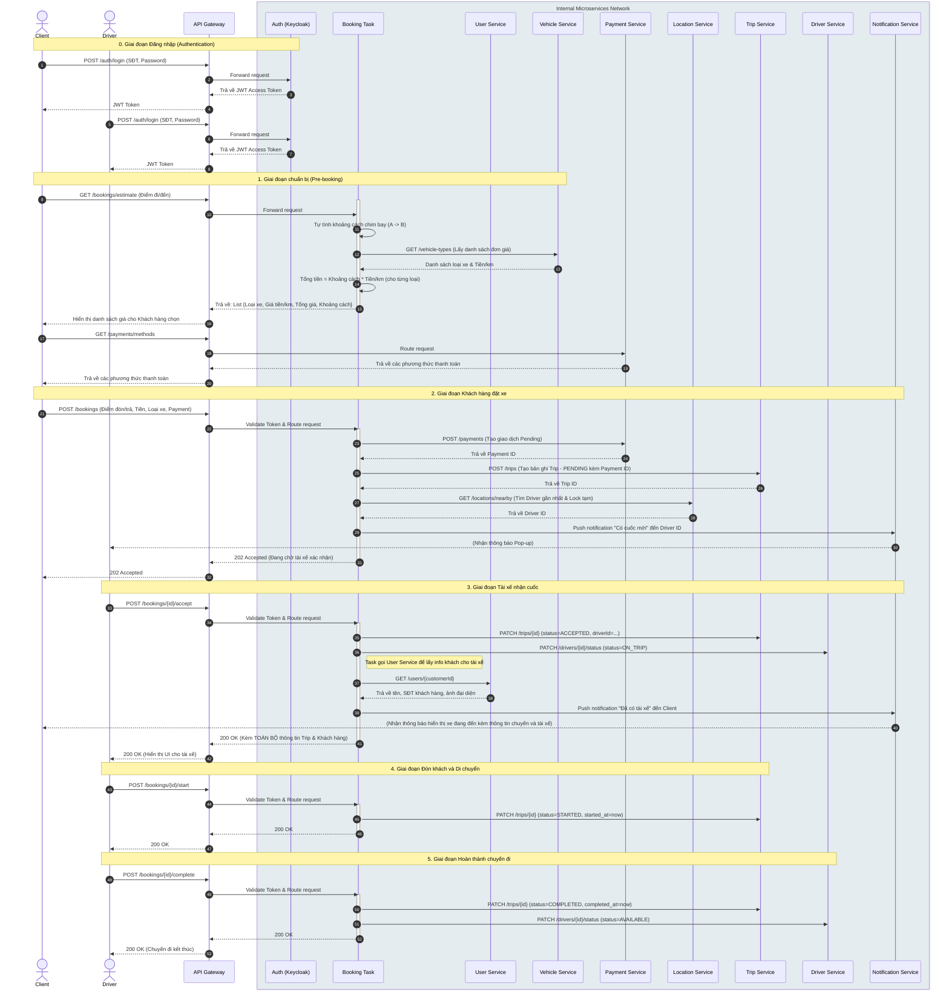
```mermaid
sequenceDiagram
    autonumber
    actor Client
    actor Driver
    participant GW as API Gateway

    box rgba(173, 216, 230, 0.2) Internal Microservices Network
        participant Auth as Auth (Keycloak)
        participant Task as Booking Task
        participant User as User Service
        participant Vehicle as Vehicle Service
        participant Payment as Payment Service
        participant Location as Location Service
        participant Trip as Trip Service
        participant DriverEntity as Driver Service
        participant Notify as Notification Service
    end

    %% --- AUTHENTICATION PHASE ---
    Note over Client, Auth: 0. Giai đoạn Đăng nhập (Authentication)
    Client->>GW: POST /auth/login (SĐT, Password)
    GW->>Auth: Forward request
    Auth-->>GW: Trả về JWT Access Token
    GW-->>Client: JWT Token
    
    Driver->>GW: POST /auth/login (SĐT, Password)
    GW->>Auth: Forward request
    Auth-->>GW: Trả về JWT Access Token
    GW-->>Driver: JWT Token

    %% --- PRE-BOOKING PHASE ---
    Note over Client, Vehicle: 1. Giai đoạn chuẩn bị (Pre-booking)
    Client->>GW: GET /bookings/estimate (Điểm đi/đến)
    activate Task
    GW->>Task: Forward request
    Task->>Task: Tự tính khoảng cách chim bay (A -> B)
    Task->>Vehicle: GET /vehicle-types (Lấy danh sách đơn giá)
    Vehicle-->>Task: Danh sách loại xe & Tiền/km
    Task->>Task: Tổng tiền = Khoảng cách * Tiền/km (cho từng loại)
    Task-->>GW: Trả về: List {Loại xe, Giá tiền/km, Tổng giá, Khoảng cách}
    deactivate Task
    GW-->>Client: Hiển thị danh sách giá cho Khách hàng chọn

    Client->>GW: GET /payments/methods
    GW->>Payment: Route request
    Payment-->>GW: Trả về các phương thức thanh toán
    GW-->>Client: Trả về các phương thức thanh toán

    %% --- BOOKING INITIATION ---
    Note over Client, Notify: 2. Giai đoạn Khách hàng đặt xe
    Client->>GW: POST /bookings (Điểm đón/trả, Tiền, Loại xe, Payment)
    GW->>Task: Validate Token & Route request
    activate Task
    
    Task->>Payment: POST /payments (Tạo giao dịch Pending)
    Payment-->>Task: Trả về Payment ID
    
    Task->>Trip: POST /trips (Tạo bản ghi Trip - PENDING kèm Payment ID)
    Trip-->>Task: Trả về Trip ID
    
    Task->>Location: GET /locations/nearby (Tìm Driver gần nhất & Lock tạm)
    Location-->>Task: Trả về Driver ID
    
    Task->>Notify: Push notification "Có cuốc mới" đến Driver ID
    Notify-->>Driver: (Nhận thông báo Pop-up)
    
    Task-->>GW: 202 Accepted (Đang chờ tài xế xác nhận)
    deactivate Task
    GW-->>Client: 202 Accepted

    %% --- DRIVER ACCEPTANCE ---
    Note over Driver, Notify: 3. Giai đoạn Tài xế nhận cuốc
    Driver->>GW: POST /bookings/{id}/accept
    GW->>Task: Validate Token & Route request
    activate Task
    
    Task->>Trip: PATCH /trips/{id} (status=ACCEPTED, driverId=...)
    Task->>DriverEntity: PATCH /drivers/{id}/status (status=ON_TRIP)
    
    Note right of Task: Task gọi User Service để lấy info khách cho tài xế
    Task->>User: GET /users/{customerId}
    User-->>Task: Trả về tên, SĐT khách hàng, ảnh đại diện
    
    Task->>Notify: Push notification "Đã có tài xế" đến Client
    Notify-->>Client: (Nhận thông báo hiển thị xe đang đến kèm thông tin chuyến và tài xế)
    
    Task-->>GW: 200 OK (Kèm TOÀN BỘ thông tin Trip & Khách hàng)
    deactivate Task
    GW-->>Driver: 200 OK (Hiển thị UI cho tài xế)

    %% --- TRIP EXECUTION ---
    Note over Driver, Trip: 4. Giai đoạn Đón khách và Di chuyển
    Driver->>GW: POST /bookings/{id}/start
    GW->>Task: Validate Token & Route request
    activate Task
    Task->>Trip: PATCH /trips/{id} (status=STARTED, started_at=now)
    Task-->>GW: 200 OK
    deactivate Task
    GW-->>Driver: 200 OK

    %% --- TRIP COMPLETION ---
    Note over Driver, DriverEntity: 5. Giai đoạn Hoàn thành chuyến đi
    Driver->>GW: POST /bookings/{id}/complete
    GW->>Task: Validate Token & Route request
    activate Task
    Task->>Trip: PATCH /trips/{id} (status=COMPLETED, completed_at=now)
    Task->>DriverEntity: PATCH /drivers/{id}/status (status=AVAILABLE)
    Task-->>GW: 200 OK
    deactivate Task
    GW-->>Driver: 200 OK (Chuyến đi kết thúc)
```

---

## Part 3 — Service-Oriented Design

> Part 3 is the **convergence point** — regardless of whether you used Step-by-Step Action or DDD in Part 2, the outputs here are the same: service contracts and service logic.

### 3.1 Uniform Contract Design

Service Contract specification for each service. Full OpenAPI specs:
- [`docs/api-specs/service-a.yaml`](api-specs/service-a.yaml)
- [`docs/api-specs/service-b.yaml`](api-specs/service-b.yaml)

> 💡 **Derive from Part 2:** Each service capability from 2.6 maps to one API endpoint. Update the OpenAPI spec files to match.

**Service 1 — Auth Service:**
| Endpoint | Method | Description | Request Body | Response Codes |
|----------|--------|-------------|--------------|----------------|
| `/auth/login` | POST | Xác thực người dùng (Client/Driver) và cấp phát JWT Token. | `{ "phone": "string", "password": "string" }` | `200 OK`, `401 Unauthorized` |

**Service 2 — User Service:**
| Endpoint | Method | Description | Request Body | Response Codes |
|----------|--------|-------------|--------------|----------------|
| `/users/{id}` | GET | Truy xuất thông tin cá nhân của khách hàng. | N/A | `200 OK`, `404 Not Found` |

**Service 3 — Driver Service:**
| Endpoint | Method | Description | Request Body | Response Codes |
|----------|--------|-------------|--------------|----------------|
| `/drivers/{id}` | GET | Truy xuất thông tin hồ sơ của tài xế. | N/A | `200 OK`, `404 Not Found` |
| `/drivers/{id}/status` | PATCH | Cập nhật trạng thái làm việc (rảnh/bận) của tài xế. | { "status": "AVAILABLE / ON_TRIP" } | `200 OK`, `400 Bad Request` |

**Service 4 — Vehicle Service:**
| Endpoint | Method | Description | Request Body | Response Codes |
|----------|--------|-------------|--------------|----------------|
| `/vehicles/{id}` | GET | Lấy thông tin chi tiết một chiếc xe (biển số, màu sắc). | N/A | `200 OK`, `404 Not Found` |
| `/vehicle-types` | GET | Lấy danh sách các loại hình xe và biểu giá cơ bản. | N/A | `200 OK` |

**Service 5 — Location Service:**

| Endpoint | Method | Description | Request Body | Response Codes |
|----------|--------|-------------|--------------|----------------|
| `/locations/nearby`| GET | Tìm tài xế rảnh gần nhất dựa trên tọa độ và loại xe. | N/A (Dùng Query params: `lat`, `lng`, `vehicleTypeId`) | `200 OK`, `404 Not Found` |
| `/locations` | POST | Cập nhật vị trí / trạng thái của tài xế | `{ "driverId": "string", "lat": number, "lng": number, "status": "string", "vehicleTypeId": "string" }` | `200 OK`, `400 Bad Request` |

---

**Service 6 — Payment Service:**

| Endpoint | Method | Description | Request Body | Response Codes |
|----------|--------|-------------|--------------|----------------|
| `/payments/methods`| GET | Lấy danh sách phương thức thanh toán hỗ trợ. | N/A | `200 OK` |
| `/payments` | POST | Khởi tạo giao dịch thanh toán. | `{ "customerId": "string", "amount": number, "method": "string" }` | `201 Created`, `400 Bad Request` |
| `/payments/{id}` | PATCH | Cập nhật trạng thái giao dịch (PAID/FAILED) và lưu mã giao dịch từ Payment Gateway trả về. | `{ "status": "string", "gatewayTransactionId": "string", "paidAt": "timestamp" }` | `200 OK`, `404 Not Found` |

**Service 7 — Trip Service:**
| Endpoint | Method | Description | Request Body | Response Codes |
|----------|--------|-------------|--------------|----------------|
| `/trips` | POST | Tạo mới một bản ghi chuyến đi. | `{ "paymentId": "string", "pickup_location": "{}", "dropoff_location": "{}", "price": number, "vehicleTypeId": "string" }` | `201 Created`, `400 Bad Request` |
| `/trips/{id}` | PATCH | Cập nhật trạng thái chuyến đi. | `{ "status": "string", "driverId": "string", "accepted_at": "timestamp", "started_at": "timestamp", "completed_at": "timestamp", "cancel_at": "timestamp" }` | `200 OK`, `409 Conflict` |

**Service 8 — Notification Service:**
| Endpoint | Method | Description | Request Body | Response Codes |
|----------|--------|-------------|--------------|----------------|
| `/notifications` | POST | Đẩy thông báo (Push notification) đến thiết bị Client/Driver. | `{ "targetId": "string", "targetType": "string", "title": "string", "body": "string", "data": {} }`| `200 OK`, `400 Bad Request` |

**Service 9 — Booking Task Service (Orchestrator):**
| Endpoint | Method | Description | Request Body | Response Codes |
|----------|--------|-------------|--------------|----------------|
| `/bookings/estimate` | GET | Ước tính khoảng cách chim bay và giá cho từng loại xe. | N/A (Query Params: `latA`, `lngA`, `latB`, `lngB`) | `200 OK`, `400 Bad Request` |
| `/bookings` | POST | Khách hàng gửi yêu cầu đặt xe, khởi tạo luồng tìm kiếm. | `{ "pickup": {}, "dropoff": {}, "vehicleTypeId": "string", "paymentMethod": "string" }` | `202 Accepted`, `400 Bad Request` |
| `/bookings/{id}/accept`| POST | Tài xế nhận cuốc, báo Notification về cho khách hàng. | `{ "driverId": "string" }` | `200 OK`, `409 Conflict` |
| `/bookings/{id}/start` | POST | Đánh dấu bắt đầu hành trình. | `{ "driverId": "string" }` | `200 OK` |
| `/bookings/{id}/complete`| POST| Hoàn tất hành trình và giải phóng tài xế. | `{ "driverId": "string" }` | `200 OK` |
| `/bookings/{id}/cancel`| POST| Hủy hành trình. | `{ "cancelReason": "string" }` | `200 OK` |

### 3.2 Service Logic Design
 
Internal processing flow for each service, based on Thomas Erl's SOA principles.
 
---
 
#### Service 1 — Auth Service *(Utility Service)*
 
> **Principles:** *Service Abstraction* — hides all authentication logic (password hashing, JWT signing). *Service Reusability* — shared by both Customer and Driver workflows.
 
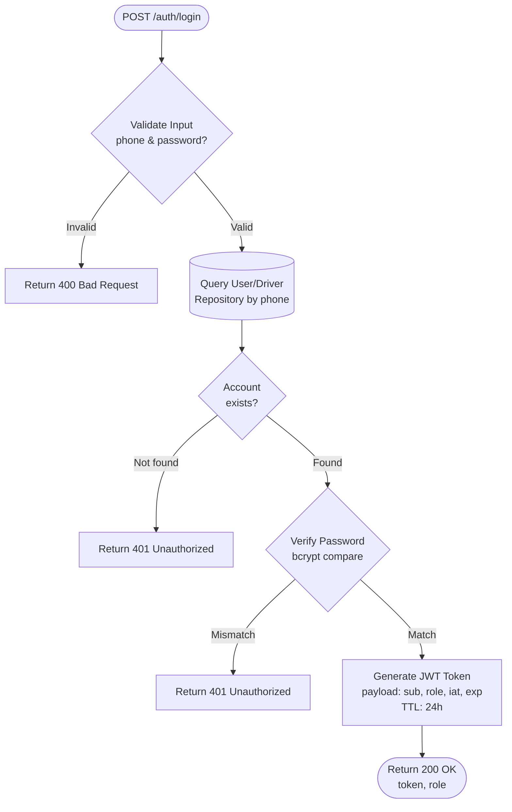
```mermaid
flowchart TD
    A([POST /auth/login]) --> B{Validate Input\nphone & password?}
    B -->|Invalid| ERR1[Return 400 Bad Request]
    B -->|Valid| C[(Query User/Driver\nRepository by phone)]
    C --> D{Account\nexists?}
    D -->|Not found| ERR2[Return 401 Unauthorized]
    D -->|Found| E{Verify Password\nbcrypt compare}
    E -->|Mismatch| ERR3[Return 401 Unauthorized]
    E -->|Match| F[Generate JWT Token\npayload: sub, role, iat, exp\nTTL: 24h]
    F --> G([Return 200 OK\ntoken, role])
```
 
---
 
#### Service 2 — User Service *(Entity Service)*
 
> **Principles:** *Service Autonomy* — owns its own User data store. *Agnostic Logic* — pure CRUD on User entity, reusable across any process.
 

```mermaid
flowchart TD
    A([GET /users/id]) --> B{Validate\nUUID format?}
    B -->|Invalid| ERR1[Return 400 Bad Request]
    B -->|Valid| C[(Query User\nRepository)]
    C --> D{User\nfound?}
    D -->|Not found| ERR2[Return 404 Not Found]
    D -->|Found| E([Return 200 OK\nid, fullName, phone, avatarUrl])
```
 
---
 
#### Service 3 — Driver Service *(Entity Service)*
 
> **Principles:** *Service Loose Coupling* — Booking Task Service does not know how driver status is stored. *Agnostic Logic* — status transitions reusable across any process.
 
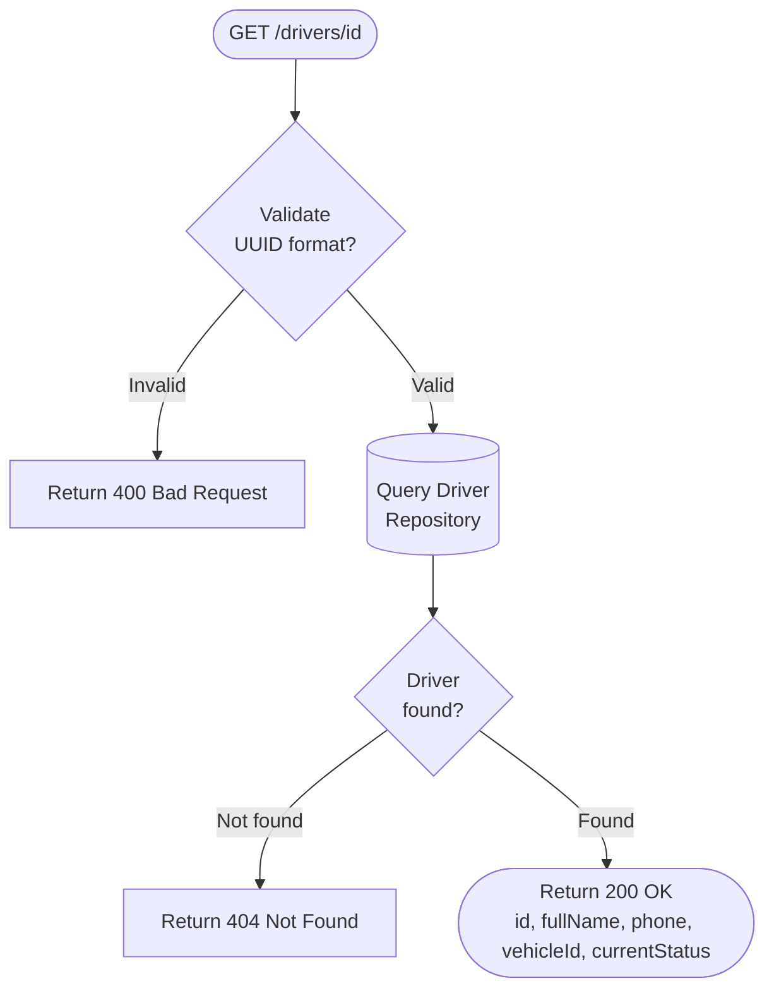
```mermaid
flowchart TD
    A([GET /drivers/id]) --> B{Validate\nUUID format?}
    B -->|Invalid| ERR1[Return 400 Bad Request]
    B -->|Valid| C[(Query Driver\nRepository)]
    C --> D{Driver\nfound?}
    D -->|Not found| ERR2[Return 404 Not Found]
    D -->|Found| E([Return 200 OK\nid, fullName, phone, vehicleId, currentStatus])
```
 
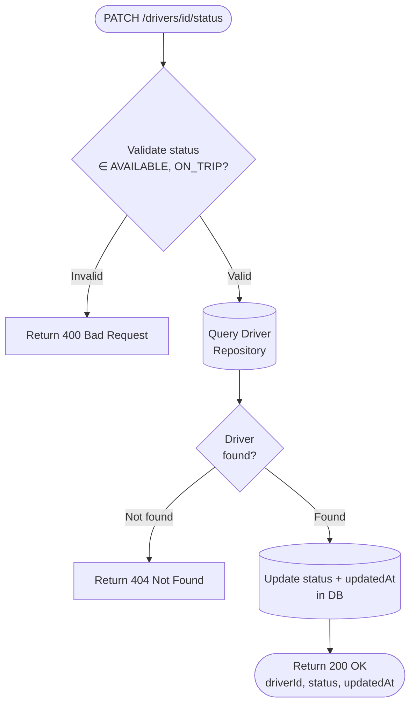
```mermaid
flowchart TD
    A([PATCH /drivers/id/status]) --> B{Validate status\n∈ AVAILABLE, ON_TRIP?}
    B -->|Invalid| ERR1[Return 400 Bad Request]
    B -->|Valid| C[(Query Driver\nRepository)]
    C --> D{Driver\nfound?}
    D -->|Not found| ERR2[Return 404 Not Found]
    D -->|Found| E[(Update status + updatedAt\nin DB)]
    E --> F([Return 200 OK\ndriverId, status, updatedAt])
```
 
---
 
#### Service 4 — Vehicle Service *(Entity Service)*
 
> **Principles:** *Service Reusability* — vehicle types and pricing are agnostic data, reusable in Booking, Reporting, Admin portal, etc.
 

```mermaid
flowchart TD
    A([GET /vehicles/id]) --> B{Validate\nUUID format?}
    B -->|Invalid| ERR1[Return 400 Bad Request]
    B -->|Valid| C[(Query Vehicle\nRepository)]
    C --> D{Vehicle\nfound?}
    D -->|Not found| ERR2[Return 404 Not Found]
    D -->|Found| E([Return 200 OK\nid, licensePlate, color, vehicleTypeId])
```
 
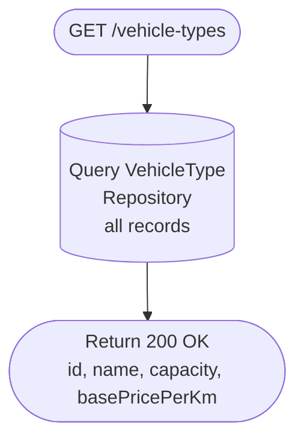
```mermaid
flowchart TD
    A([GET /vehicle-types]) --> B[(Query VehicleType\nRepository\nall records)]
    B --> C([Return 200 OK\nid, name, capacity, basePricePerKm])
```
 
---
 
#### Service 5 — Location Service *(Microservice)*
 
> **Principles:** *Service Autonomy (highest degree)* — decomposed as a separate Microservice with its own data store (Redis Geo) to meet the Performance NFR (find driver < 10s). This is Thomas Erl's capability-driven decomposition when NFRs require independent operation and scaling.
 
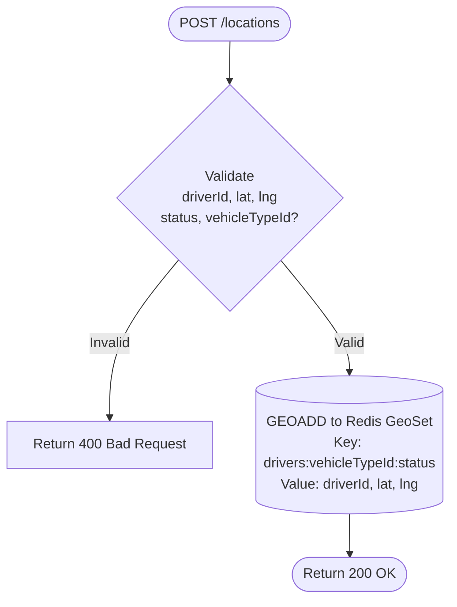
```mermaid
flowchart TD
    A([POST /locations]) --> B{Validate\ndriverId, lat, lng\nstatus, vehicleTypeId?}
    B -->|Invalid| ERR1[Return 400 Bad Request]
    B -->|Valid| C[(GEOADD to Redis GeoSet\nKey: drivers:vehicleTypeId:status\nValue: driverId, lat, lng)]
    C --> D([Return 200 OK])
```
 
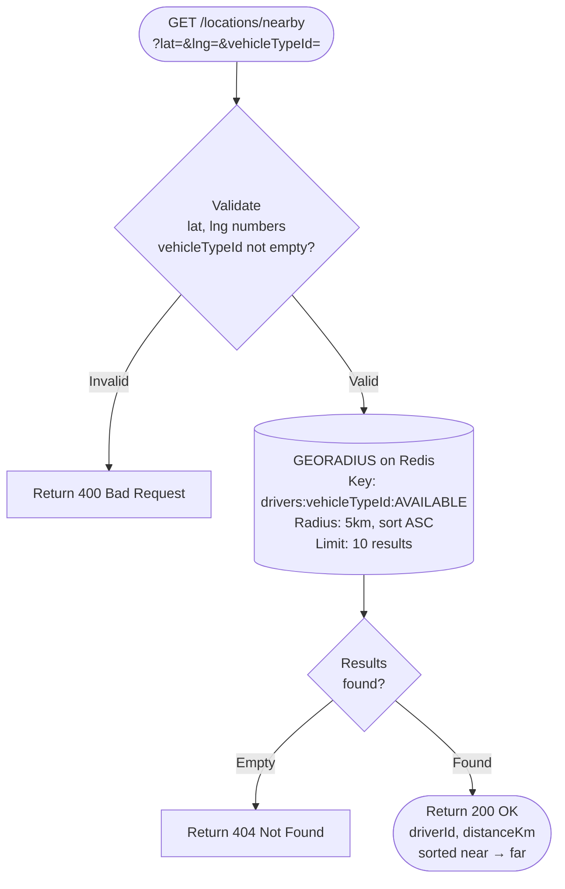
```mermaid
flowchart TD
    A([GET /locations/nearby\n?lat=&lng=&vehicleTypeId=]) --> B{Validate\nlat, lng numbers\nvehicleTypeId not empty?}
    B -->|Invalid| ERR1[Return 400 Bad Request]
    B -->|Valid| C[(GEORADIUS on Redis\nKey: drivers:vehicleTypeId:AVAILABLE\nRadius: 5km, sort ASC\nLimit: 10 results)]
    C --> D{Results\nfound?}
    D -->|Empty| ERR2[Return 404 Not Found]
    D -->|Found| E([Return 200 OK\ndriverId, distanceKm\nsorted near → far])
```
 
---
 
#### Service 6 — Payment Service *(Entity Service)*
 
> **Principles:** *Service Abstraction* — hides all Payment Gateway integration. *Agnostic Logic* — transaction lifecycle (PENDING → PAID/FAILED) is reusable logic.
 
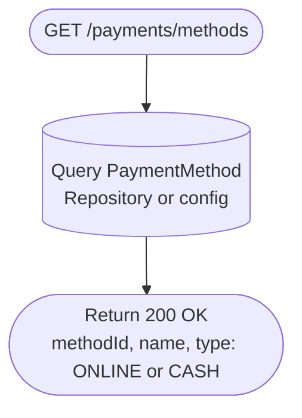
```mermaid
flowchart TD
    A([GET /payments/methods]) --> B[(Query PaymentMethod\nRepository or config)]
    B --> C([Return 200 OK\nmethodId, name, type: ONLINE or CASH])
```
 
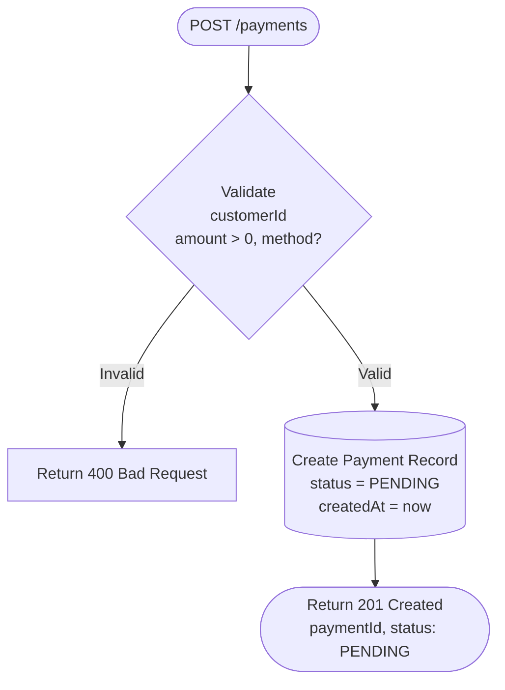
```mermaid
flowchart TD
    A([POST /payments]) --> B{Validate\ncustomerId\namount > 0, method?}
    B -->|Invalid| ERR1[Return 400 Bad Request]
    B -->|Valid| C[(Create Payment Record\nstatus = PENDING\ncreatedAt = now)]
    C --> D([Return 201 Created\npaymentId, status: PENDING])
```
 
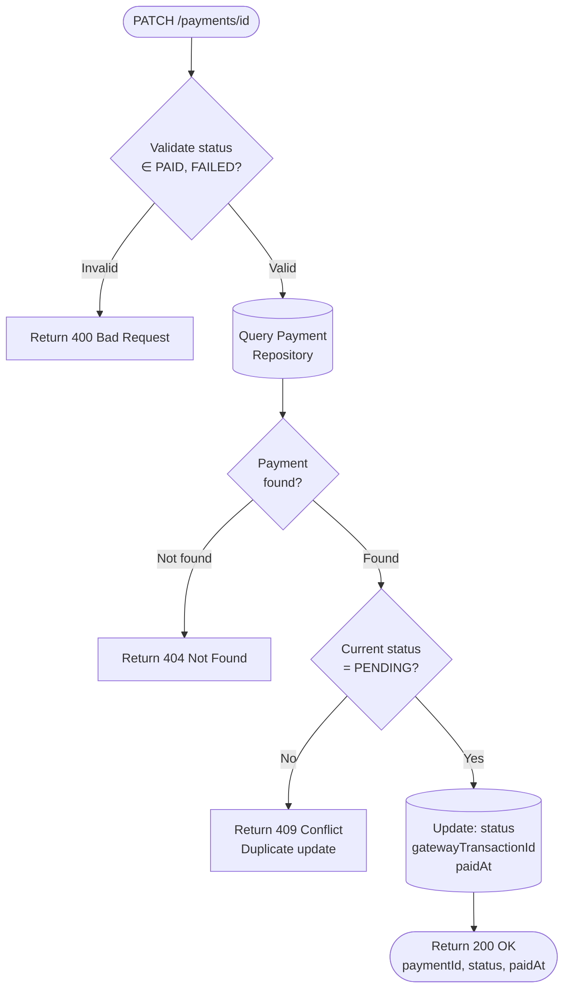
```mermaid
flowchart TD
    A([PATCH /payments/id]) --> B{Validate status\n∈ PAID, FAILED?}
    B -->|Invalid| ERR1[Return 400 Bad Request]
    B -->|Valid| C[(Query Payment\nRepository)]
    C --> D{Payment\nfound?}
    D -->|Not found| ERR2[Return 404 Not Found]
    D -->|Found| E{Current status\n= PENDING?}
    E -->|No| ERR3[Return 409 Conflict\nDuplicate update]
    E -->|Yes| F[(Update: status\ngatewayTransactionId\npaidAt)]
    F --> G([Return 200 OK\npaymentId, status, paidAt])
```
 
---
 
#### Service 7 — Trip Service *(Entity Service)*
 
> **Principles:** *Service Autonomy* — owns the complete Trip lifecycle (PENDING → ACCEPTED → STARTED → COMPLETED). *Agnostic Logic* — state machine encapsulation reusable across any trip-related process.
 
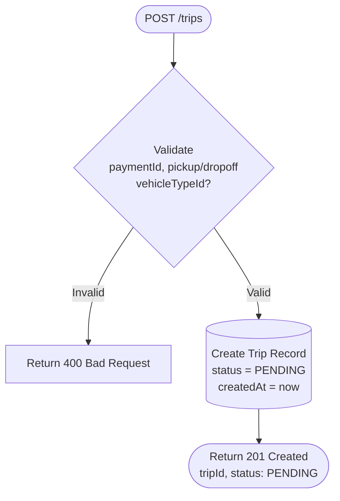
```mermaid
flowchart TD
    A([POST /trips]) --> B{Validate\npaymentId, pickup/dropoff\nvehicleTypeId?}
    B -->|Invalid| ERR1[Return 400 Bad Request]
    B -->|Valid| C[(Create Trip Record\nstatus = PENDING\ncreatedAt = now)]
    C --> D([Return 201 Created\ntripId, status: PENDING])
```
 
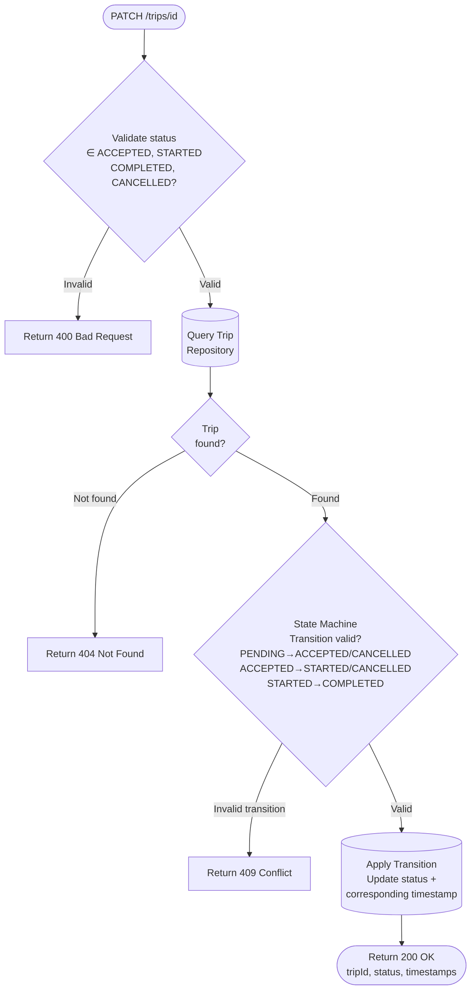
```mermaid
flowchart TD
    A([PATCH /trips/id]) --> B{Validate status\n∈ ACCEPTED, STARTED\nCOMPLETED, CANCELLED?}
    B -->|Invalid| ERR1[Return 400 Bad Request]
    B -->|Valid| C[(Query Trip\nRepository)]
    C --> D{Trip\nfound?}
    D -->|Not found| ERR2[Return 404 Not Found]
    D -->|Found| E{State Machine\nTransition valid?\nPENDING→ACCEPTED/CANCELLED\nACCEPTED→STARTED/CANCELLED\nSTARTED→COMPLETED}
    E -->|Invalid transition| ERR3[Return 409 Conflict]
    E -->|Valid| F[(Apply Transition\nUpdate status +\ncorresponding timestamp)]
    F --> G([Return 200 OK\ntripId, status, timestamps])
```
 
---
 
#### Service 8 — Notification Service *(Utility Service)*
 
> **Principles:** *Service Abstraction* — hides all FCM/WebSocket integration details. *Service Reusability* — any service or process can call this without knowing the push notification infrastructure.
 
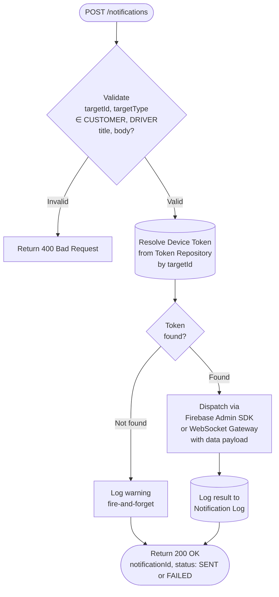
```mermaid
flowchart TD
    A([POST /notifications]) --> B{Validate\ntargetId, targetType\n∈ CUSTOMER, DRIVER\ntitle, body?}
    B -->|Invalid| ERR1[Return 400 Bad Request]
    B -->|Valid| C[(Resolve Device Token\nfrom Token Repository\nby targetId)]
    C --> D{Token\nfound?}
    D -->|Not found| LOG[Log warning\nfire-and-forget]
    LOG --> OK
    D -->|Found| E[Dispatch via\nFirebase Admin SDK\nor WebSocket Gateway\nwith data payload]
    E --> F[(Log result to\nNotification Log)]
    F --> OK([Return 200 OK\nnotificationId, status: SENT or FAILED])
```
 
---
 
#### Service 9 — Booking Task Service *(Non-Agnostic / Orchestrator)*
 
> **Principles:** *Service Composability* — this is a **Composed Service** per Thomas Erl. It contains no agnostic logic of its own; it orchestrates Entity/Utility Services in the correct business order. All process-specific logic is centralized here, keeping agnostic services clean and reusable.
 
**GET /bookings/estimate** — Price Estimation
 
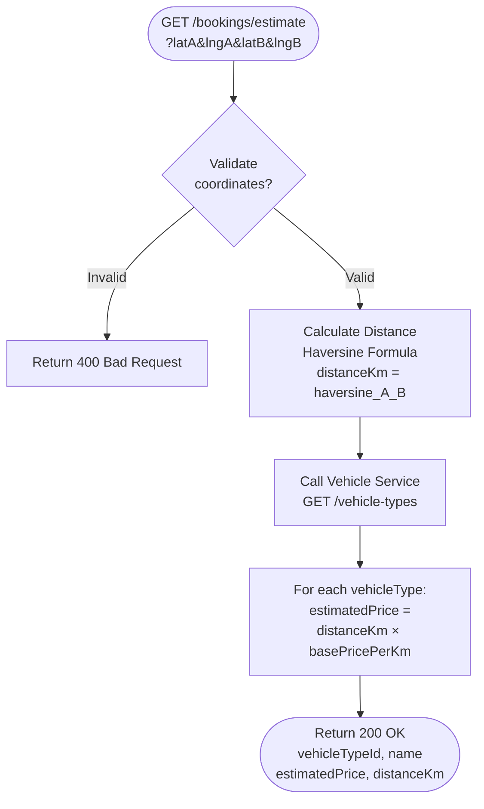
```mermaid
flowchart TD
    A([GET /bookings/estimate\n?latA&lngA&latB&lngB]) --> B{Validate\ncoordinates?}
    B -->|Invalid| ERR1[Return 400 Bad Request]
    B -->|Valid| C[Calculate Distance\nHaversine Formula\ndistanceKm = haversine_A_B]
    C --> D[Call Vehicle Service\nGET /vehicle-types]
    D --> E[For each vehicleType:\nestimatedPrice =\ndistanceKm × basePricePerKm]
    E --> F([Return 200 OK\nvehicleTypeId, name\nestimatedPrice, distanceKm])
```
 
**POST /bookings** — Booking Creation Orchestration
 
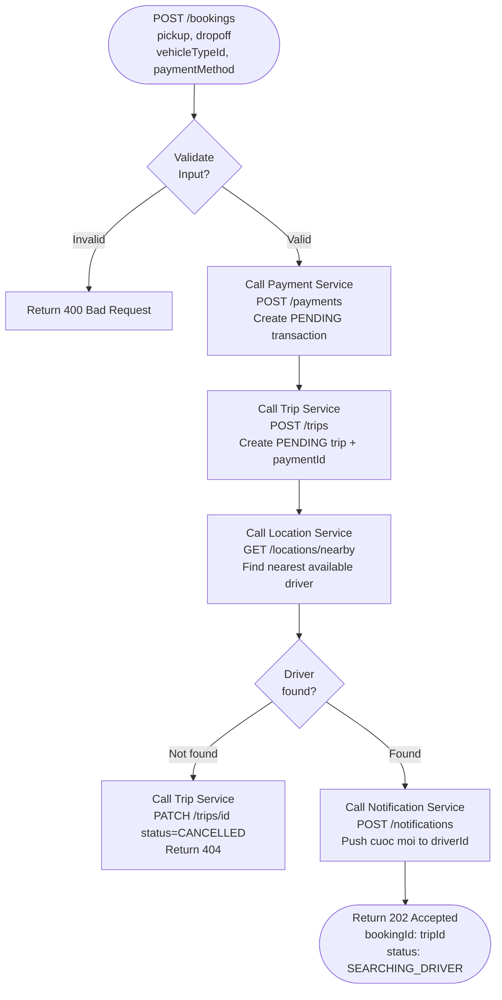
```mermaid
flowchart TD
    A([POST /bookings\npickup, dropoff\nvehicleTypeId, paymentMethod]) --> B{Validate\nInput?}
    B -->|Invalid| ERR1[Return 400 Bad Request]
    B -->|Valid| C[Call Payment Service\nPOST /payments\nCreate PENDING transaction]
    C --> D[Call Trip Service\nPOST /trips\nCreate PENDING trip + paymentId]
    D --> E[Call Location Service\nGET /locations/nearby\nFind nearest available driver]
    E --> F{Driver\nfound?}
    F -->|Not found| CANCEL[Call Trip Service\nPATCH /trips/id status=CANCELLED\nReturn 404]
    F -->|Found| G[Call Notification Service\nPOST /notifications\nPush cuoc moi to driverId]
    G --> H([Return 202 Accepted\nbookingId: tripId\nstatus: SEARCHING_DRIVER])
```
 
**POST /bookings/{id}/accept** — Driver Accept Orchestration
 
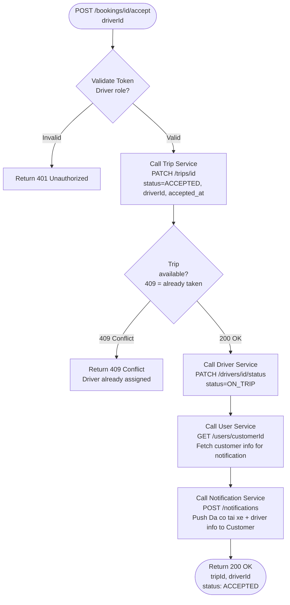
```mermaid
flowchart TD
    A([POST /bookings/id/accept\ndriverId]) --> B{Validate Token\nDriver role?}
    B -->|Invalid| ERR1[Return 401 Unauthorized]
    B -->|Valid| C[Call Trip Service\nPATCH /trips/id\nstatus=ACCEPTED, driverId, accepted_at]
    C --> D{Trip\navailable?\n409 = already taken}
    D -->|409 Conflict| ERR2[Return 409 Conflict\nDriver already assigned]
    D -->|200 OK| E[Call Driver Service\nPATCH /drivers/id/status\nstatus=ON_TRIP]
    E --> F[Call User Service\nGET /users/customerId\nFetch customer info for notification]
    F --> G[Call Notification Service\nPOST /notifications\nPush Da co tai xe + driver info to Customer]
    G --> H([Return 200 OK\ntripId, driverId\nstatus: ACCEPTED])
```
 
**POST /bookings/{id}/start** — Trip Start Orchestration
 
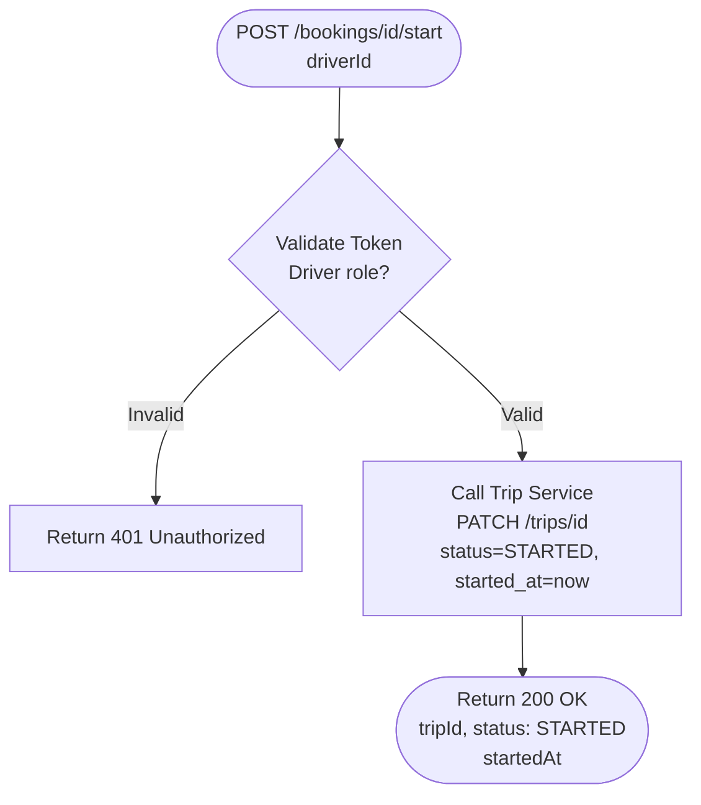
```mermaid
flowchart TD
    A([POST /bookings/id/start\ndriverId]) --> B{Validate Token\nDriver role?}
    B -->|Invalid| ERR1[Return 401 Unauthorized]
    B -->|Valid| C[Call Trip Service\nPATCH /trips/id\nstatus=STARTED, started_at=now]
    C --> D([Return 200 OK\ntripId, status: STARTED\nstartedAt])
```
 
**POST /bookings/{id}/complete** — Trip Complete Orchestration
 
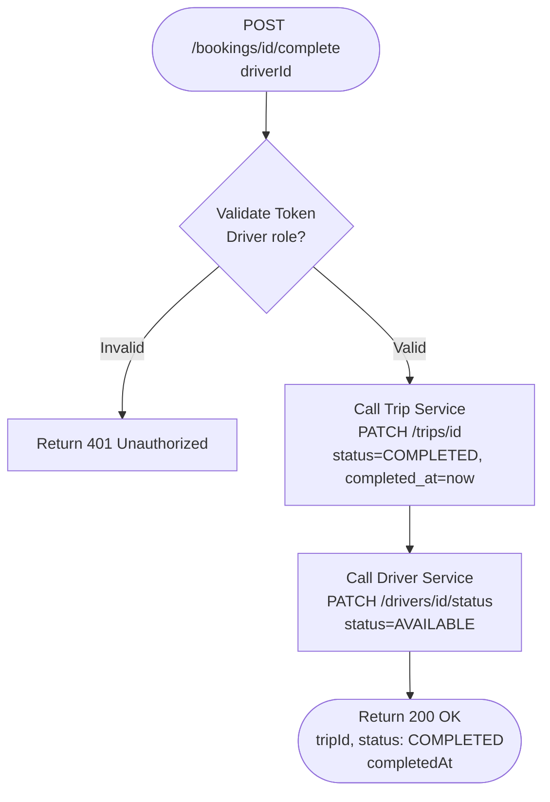
```mermaid
flowchart TD
    A([POST /bookings/id/complete\ndriverId]) --> B{Validate Token\nDriver role?}
    B -->|Invalid| ERR1[Return 401 Unauthorized]
    B -->|Valid| C[Call Trip Service\nPATCH /trips/id\nstatus=COMPLETED, completed_at=now]
    C --> D[Call Driver Service\nPATCH /drivers/id/status\nstatus=AVAILABLE]
    D --> E([Return 200 OK\ntripId, status: COMPLETED\ncompletedAt])
```
 
**POST /bookings/{id}/cancel** — Cancellation Orchestration
 
```mermaid
flowchart TD
    A([POST /bookings/id/cancel\ncancelReason]) --> B{Validate\nInput?}
    B -->|Invalid| ERR1[Return 400 Bad Request]
    B -->|Valid| C[Call Trip Service\nPATCH /trips/id\nstatus=CANCELLED, cancel_at=now]
    C --> D{driverId\nalready assigned?}
    D -->|Yes| E[Call Driver Service\nPATCH /drivers/id/status\nstatus=AVAILABLE]
    D -->|No| F
    E --> F{Payment status\n= PAID?}
    F -->|Yes| G[Call Payment Service\nPATCH /payments/id\nstatus=REFUNDED]
    F -->|No| H
    G --> H([Return 200 OK\ntripId, status: CANCELLED])
```
 
---
