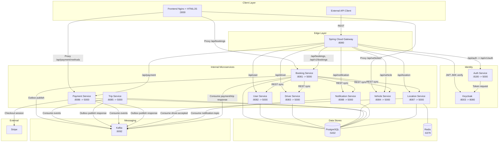

# System Architecture

> This document is completed **after** the Analysis and Design phase.
> Choose **one** analysis approach and complete it first:
> - [Analysis and Design — Step-by-Step Action](analysis-and-design.md)
> - [Analysis and Design — DDD](analysis-and-design-ddd.md)
>
> Both approaches produce the same inputs for this document: **Service Candidates**, **Service Composition**, and **Non-Functional Requirements**.

**References:**
1. *Service-Oriented Architecture: Analysis and Design for Services and Microservices* — Thomas Erl (2nd Edition)
2. *Microservices Patterns: With Examples in Java* — Chris Richardson
3. *Bài tập — Phát triển phần mềm hướng dịch vụ* — Hung Dang (available in Vietnamese)

---

### How this document connects to Analysis & Design

```
┌─────────────────────────────────────────────────────┐
│         Analysis & Design (choose one)              │
│                                                     │
│  Step-by-Step Action        DDD                     │
│  Part 1: Analysis Prep     Part 1: Domain Discovery │
│  Part 2: Decompose →       Part 2: Strategic DDD →  │
│    Service Candidates        Bounded Contexts       │
│  Part 3: Service Design    Part 3: Service Design   │
│    (contract + logic)        (contract + logic)     │
└────────────────┬────────────────────────────────────┘
                 │ inputs: service list, NFRs,
                 │         service contracts (API specs)
                 ▼
┌─────────────────────────────────────────────────────┐
│         Architecture (this document)                │
│                                                     │
│  1. Pattern Selection                               │
│  2. System Components (tech stack, ports)           │
│  3. Communication Matrix                            │
│  4. Architecture Diagram                            │
│  5. Deployment                                      │
└─────────────────────────────────────────────────────┘
```

> 💡 **What you need before starting:** your completed service list from Part 2 (service candidates and their responsibilities) and your service contracts from Part 3 (API endpoints). This document turns those logical designs into a concrete, deployable system architecture.

---

## 1. Pattern Selection

Select patterns based on business/technical justifications from your analysis.

| Pattern | Selected? | Business/Technical Justification                                                                                                                                                                                                                                                                                                                                                                                                                                                                                                                                                                                                                                                                                                               |
|---|---|------------------------------------------------------------------------------------------------------------------------------------------------------------------------------------------------------------------------------------------------------------------------------------------------------------------------------------------------------------------------------------------------------------------------------------------------------------------------------------------------------------------------------------------------------------------------------------------------------------------------------------------------------------------------------------------------------------------------------------------------|
| API Gateway | ✅ | Đóng vai trò single entry point, xác thực JWT (do Keycloak cấp) trước khi route vào Internal Microservices Network. Các service nội bộ không cần tự xử lý auth. Giúp routing chỉ qua 1 api entpoint duy nhất                                                                                                                                                                                                                                                                                                                                                                                                                                                                                                                                   |
| Database per Service | ✅ | Mỗi service (User, Driver, Trip, Payment, Location) quản lý data store riêng, đảm bảo *Service Autonomy* theo Thomas Erl. Không service nào truy cập trực tiếp DB của service khác.                                                                                                                                                                                                                                                                                                                                                                                                                                                                                                                                                            |
| Shared Database | ❌ | Vi phạm *Service Autonomy* và *Loose Coupling* — loại bỏ.                                                                                                                                                                                                                                                                                                                                                                                                                                                                                                                                                                                                                                                                                      |
| Saga (Orchestration) | ✅ | Quản lý giao dịch phân tán cho luồng Đặt xe. Quy trình đặt xe đi qua nhiều DB độc lập (Tạo chuyến $\rightarrow$ Thanh toán $\rightarrow$ Tìm tài xế). Booking Task làm Nhạc trưởng điều phối: nếu tìm tài xế thất bại, nó lập tức tự động ra lệnh cho Payment hoàn tiền và Trip hủy chuyến (Compensating Transaction), đảm bảo hệ thống không bị rác dữ liệu và khách không bị mất tiền oan. |
| Outbox Pattern | ✅ | Đảm bảo tính nhất quán (Consistency) và không mất thông điệp. Ngăn chặn lỗi "lưu DB xong nhưng rớt mạng chưa kịp gửi thông báo". Ví dụ: Payment trừ tiền thành công nhưng server sập trước khi kịp báo cho Booking Task. Outbox gom việc lưu hóa đơn và tạo Event vào cùng một Local Transaction, đảm bảo dữ liệu luôn đồng bộ tuyệt đối dù có sự cố hạ tầng.                                                                                                                                                                                                                               |
| Event-driven / Message Queue | ✅ | Trong Saga flow, một số bước không cần kết quả ngay và cần đảm bảo durability. Ví dụ: sau khi Booking Task publish event `PaymentRequested`, Payment Service có thể bị tắt đột ngột; khi khởi động lại, nó vẫn đọc được event từ Kafka và tiếp tục xử lý — không mất request. Kafka đóng vai trò message broker bền vững cho các bước async này, đồng thời hỗ trợ retry khi consumer xử lý thất bại.                                                                                                                                                                                                                                                                                                                                           |
| CQRS | ❌ | Không có yêu cầu read-model phức tạp trong phạm vi quy trình đặt xe — loại bỏ để tránh phức tạp không cần thiết.                                                                                                                                                                                                                                                                                                                                                                                                                                                                                                                                                                                                                               |
| Circuit Breaker | ❌ | Chưa áp dụng trong phạm vi bài tập này.                                                                                                                                                                                                                                                                                                                                                                                                                                                                                                                                                                                                                                                                                                        |
| Service Registry / Discovery | ❌ | Trong phạm vi bài tập, các service deploy bằng Docker Compose với hostname cố định — không cần dynamic discovery.                                                                                                                                                                                                                                                                                                                                                                                                                                                                                                                                                                                                                              |
 
---

> Reference: *Microservices Patterns* — Chris Richardson, chapters on decomposition, data management, and communication patterns.

---

## 2. System Components

| Component | Responsibility | Tech Stack                            | Port |
|---|---|---------------------------------------|------|
| **Client** | Giao diện Khách hàng và Tài xế | HTML                                  | 3000 |
| **API Gateway** | Single entry point: xác thực JWT với Keycloak, routing vào Internal Network, role-based access control (Customer không gọi driver-endpoint và ngược lại) | Spring Cloud Gateway                  | 8080 |
| **Auth Service** | Xác thực người dùng (POST /auth/login), cấp phát JWT Token với claim `role` (CUSTOMER / DRIVER) | Keycloak                              | 8180 |
| **Booking Task Service** | Saga Orchestrator: điều phối luồng đặt xe, publish/consume Kafka events, xử lý compensating transaction | Spring Boot, PostgreSQL, Kafka        | 8081 |
| **User Service** | GET thông tin Khách hàng (GET /users/{id}) | Spring Boot, PostgreSQL               | 8082 |
| **Driver Service** | GET/UPDATE thông tin Tài xế, cập nhật trạng thái AVAILABLE/ON_TRIP | Spring Boot, PostgreSQL               | 8083 |
| **Vehicle Service** | GET thông tin xe, loại xe và biểu giá cơ bản | Spring Boot, PostgreSQL               | 8084 |
| **Trip Service** | Quản lý vòng đời chuyến đi | Spring Boot, PostgreSQL, Kafka        | 8085 |
| **Payment Service** | Quản lý giao dịch | Spring Boot, PostgreSQL, Kafka        | 8086 |
| **Location Service** | Geospatial query tìm tài xế gần nhất (GEOADD / GEORADIUS) | Spring Boot, PostgreSQL, Redis, Kafka | 8087 |
| **Notification Service** | Nhận và push notification đến Client/Driver qua WebSocket | Spring Boot, PostgreSQL               | 8088 |
| **Apache Kafka** | Message broker bền vững cho Saga async events và Outbox relay | Apache Kafka + Zookeeper              | 9092 |
| **PostgreSQL** | Relational DB — mỗi service có schema riêng | PostgreSQL                            | 5432 |
| **Redis** | Geospatial store riêng cho Location Service (GEOADD / GEORADIUS) | Redis                                 | 6379 |
 
---

## 3. Communication

### Inter-service Communication Matrix

| From -> To | API Gateway | Keycloak | Auth | Booking Task | User | Driver | Vehicle | Trip | Payment | Location | Notification |
|---|---|---|---|---|---|---|---|---|---|---|---|
| **Frontend (Nginx, :3000)** | - | - | - | REST (proxy) | - | - | REST (proxy) | - | REST (proxy) | - | - |
| **External API Client** | REST | - | - | - | - | - | - | - | - | - | - |
| **API Gateway (:8080)** | - | HTTP (JWK verify) | REST (`/api/auth`) | REST (`/api/bookings*`) | REST (`/api/user*`) | REST (`/api/driver*`) | REST (`/api/vehicle*`) | - (route off) | REST (`/api/payment*`) | REST (`/api/location*`) | REST (`/api/notification*`) |
| **Auth Service** | - | HTTP (token/JWK) | - | - | - | - | - | - | - | - | - |
| **Booking Task Service** | - | - | - | - | REST <-> | REST <-> | REST <-> | EVENT <-> | EVENT <-> | REST/EVENT <-> | REST <-> |
| **User Service** | - | - | - | REST <-> | - | - | - | - | - | - | - |
| **Driver Service** | - | - | - | REST <-> | - | - | - | - | - | - | - |
| **Vehicle Service** | - | - | - | REST <-> | - | - | - | - | - | - | - |
| **Trip Service** | - | - | - | EVENT <-> | - | - | - | - | - | - | - |
| **Payment Service** | - | - | - | EVENT <-> | - | - | - | - | - | - | - |
| **Location Service** | - | - | - | REST/EVENT <-> | - | - | - | - | - | - | - |
| **Notification Service** | - | - | - | REST <-> | - | - | - | - | - | - | - |

> **Sync REST**: dùng cho các bước trong Saga cần kết quả ngay (vd: tạo Payment, tạo Trip, tìm tài xế).
> **Async Kafka**: dùng cho Outbox relay — đảm bảo các event không bị mất khi Booking Task Service crash giữa luồng.
---

## 4. Architecture Diagram

> Place diagrams in `docs/asset/` and reference here.



---

## 5. Deployment

- All services containerized with Docker
- Orchestrated via Docker Compose
- Single command: `docker compose up --build`
