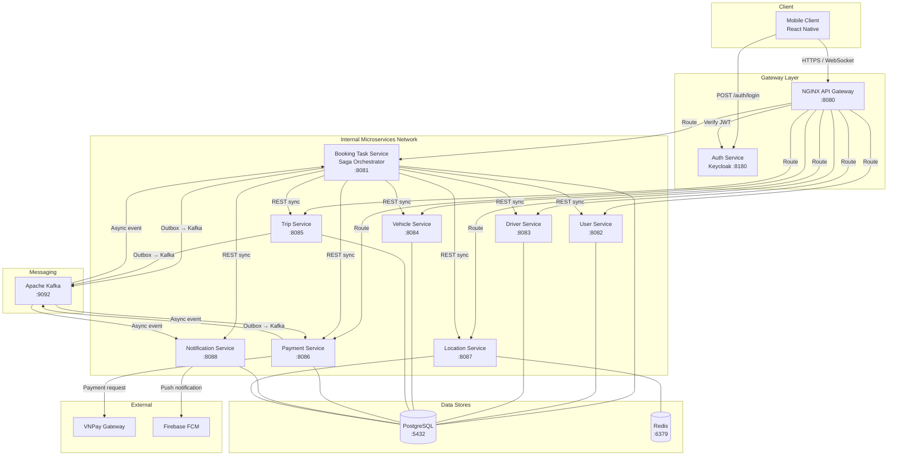

# System Architecture

> This document is completed **after** the Analysis and Design phase.
> Choose **one** analysis approach and complete it first:
> - [Analysis and Design — Step-by-Step Action](analysis-and-design.md)
> - [Analysis and Design — DDD](analysis-and-design-ddd.md)
>
> Both approaches produce the same inputs for this document: **Service Candidates**, **Service Composition**, and **Non-Functional Requirements**.

**References:**
1. *Service-Oriented Architecture: Analysis and Design for Services and Microservices* — Thomas Erl (2nd Edition)
2. *Microservices Patterns: With Examples in Java* — Chris Richardson
3. *Bài tập — Phát triển phần mềm hướng dịch vụ* — Hung Dang (available in Vietnamese)

---

### How this document connects to Analysis & Design

```
┌─────────────────────────────────────────────────────┐
│         Analysis & Design (choose one)              │
│                                                     │
│  Step-by-Step Action        DDD                     │
│  Part 1: Analysis Prep     Part 1: Domain Discovery │
│  Part 2: Decompose →       Part 2: Strategic DDD →  │
│    Service Candidates        Bounded Contexts       │
│  Part 3: Service Design    Part 3: Service Design   │
│    (contract + logic)        (contract + logic)     │
└────────────────┬────────────────────────────────────┘
                 │ inputs: service list, NFRs,
                 │         service contracts (API specs)
                 ▼
┌─────────────────────────────────────────────────────┐
│         Architecture (this document)                │
│                                                     │
│  1. Pattern Selection                               │
│  2. System Components (tech stack, ports)           │
│  3. Communication Matrix                            │
│  4. Architecture Diagram                            │
│  5. Deployment                                      │
└─────────────────────────────────────────────────────┘
```

> 💡 **What you need before starting:** your completed service list from Part 2 (service candidates and their responsibilities) and your service contracts from Part 3 (API endpoints). This document turns those logical designs into a concrete, deployable system architecture.

---

## 1. Pattern Selection

Select patterns based on business/technical justifications from your analysis.

| Pattern | Selected? | Business/Technical Justification |
|---|---|---|
| API Gateway | ✅ | NFR bảo mật yêu cầu role-based access: Customer không gọi được driver-endpoint và ngược lại. NGINX đóng vai trò single entry point, xác thực JWT (do Keycloak cấp) trước khi route vào Internal Microservices Network. Các service nội bộ không cần tự xử lý auth. |
| Database per Service | ✅ | Mỗi service (User, Driver, Trip, Payment, Location) quản lý data store riêng, đảm bảo *Service Autonomy* theo Thomas Erl. Không service nào truy cập trực tiếp DB của service khác. |
| Shared Database | ❌ | Vi phạm *Service Autonomy* và *Loose Coupling* — loại bỏ. |
| Saga (Orchestration) | ✅ | Luồng đặt xe (POST /bookings) yêu cầu ghi dữ liệu trải dài qua nhiều service độc lập: Payment Service tạo giao dịch, Trip Service tạo chuyến đi, Location Service tìm tài xế, Notification Service gửi thông báo. Vì mỗi service có DB riêng (Database per Service), không thể dùng một ACID transaction duy nhất để đảm bảo tính nhất quán. Saga Orchestration giải quyết vấn đề này bằng cách chia thành chuỗi local transaction, mỗi bước thất bại sẽ kích hoạt compensating transaction để rollback các bước trước (vd: không tìm được tài xế → PATCH /trips/{id} status=CANCELLED). Booking Task Service đóng vai trò Orchestrator vì đây là Non-Agnostic Task Service — nơi duy nhất chứa process-specific logic theo thiết kế ở Part 2. |
| Outbox Pattern | ✅ | Khi Booking Task Service publish một Kafka event (vd: `BookingCreated`), có thể xảy ra tình huống: ghi DB thành công nhưng service crash trước khi kịp gửi lên Kafka, hoặc ngược lại. Outbox Pattern giải quyết bằng cách ghi event vào bảng `outbox` trong **cùng một DB transaction** với dữ liệu nghiệp vụ, sau đó một Outbox relay process đọc và publish lên Kafka. Điều này áp dụng cho tất cả service có dùng Kafka (Booking Task, Trip, Payment, Location, Notification) — không chỉ riêng Booking Task. |
| Event-driven / Message Queue | ✅ | Trong Saga flow, một số bước không cần kết quả ngay và cần đảm bảo durability. Ví dụ: sau khi Booking Task publish event `PaymentRequested`, Payment Service có thể bị tắt đột ngột; khi khởi động lại, nó vẫn đọc được event từ Kafka và tiếp tục xử lý — không mất request. Kafka đóng vai trò message broker bền vững cho các bước async này, đồng thời hỗ trợ retry khi consumer xử lý thất bại. |
| CQRS | ❌ | Không có yêu cầu read-model phức tạp trong phạm vi quy trình đặt xe — loại bỏ để tránh phức tạp không cần thiết. |
| Circuit Breaker | ❌ | Chưa áp dụng trong phạm vi bài tập này. |
| Service Registry / Discovery | ❌ | Trong phạm vi bài tập, các service deploy bằng Docker Compose với hostname cố định — không cần dynamic discovery. |
 
---

> Reference: *Microservices Patterns* — Chris Richardson, chapters on decomposition, data management, and communication patterns.

---

## 2. System Components

| Component | Responsibility | Tech Stack | Port |
|---|---|---|---|
| **Mobile Client** | Giao diện Khách hàng và Tài xế | React Native | — |
| **API Gateway** | Single entry point: xác thực JWT với Keycloak, routing vào Internal Network, role-based access control (Customer không gọi driver-endpoint và ngược lại) | NGINX | 8080 |
| **Auth Service** | Xác thực người dùng (POST /auth/login), cấp phát JWT Token với claim `role` (CUSTOMER / DRIVER) | Keycloak | 8180 |
| **Booking Task Service** | Saga Orchestrator: điều phối luồng đặt xe, publish/consume Kafka events, xử lý compensating transaction | Spring Boot, PostgreSQL, Kafka | 8081 |
| **User Service** | GET thông tin Khách hàng (GET /users/{id}) | Spring Boot, PostgreSQL | 8082 |
| **Driver Service** | GET/UPDATE thông tin Tài xế, cập nhật trạng thái AVAILABLE/ON_TRIP | Spring Boot, PostgreSQL | 8083 |
| **Vehicle Service** | GET thông tin xe, loại xe và biểu giá cơ bản | Spring Boot, PostgreSQL | 8084 |
| **Trip Service** | Quản lý vòng đời chuyến đi | Spring Boot, PostgreSQL, Kafka Producer | 8085 |
| **Payment Service** | Quản lý giao dịch, tích hợp VNPay Gateway, consume Kafka event để xử lý thanh toán | Spring Boot, PostgreSQL, Kafka Producer/Consumer | 8086 |
| **Location Service** | Geospatial query tìm tài xế gần nhất (GEOADD / GEORADIUS), cập nhật vị trí tài xế real-time, publish Kafka event khi có cập nhật vị trí | Spring Boot, PostgreSQL, Redis, Kafka Producer | 8087 |
| **Notification Service** | Nhận Kafka event và push notification đến Client/Driver qua FCM/WebSocket | Spring Boot, PostgreSQL, Kafka Consumer | 8088 |
| **Apache Kafka** | Message broker bền vững cho Saga async events và Outbox relay | Apache Kafka + Zookeeper | 9092 |
| **PostgreSQL** | Relational DB — mỗi service có schema riêng | PostgreSQL | 5432 |
| **Redis** | Geospatial store riêng cho Location Service (GEOADD / GEORADIUS) | Redis | 6379 |
 
---

## 3. Communication

### Inter-service Communication Matrix

| From → To | API Gateway | Keycloak | Booking Task | User | Driver | Vehicle | Trip | Payment | Location | Notification |
|---|---|---|---|---|---|---|---|---|---|---|
| **Mobile Client** | REST/HTTPS | — | — | — | — | — | — | — | — | — |
| **API Gateway** | — | REST (JWT verify) | REST | REST | REST | REST | REST | REST | REST | REST |
| **Booking Task** | — | — | — | REST (sync) | REST (sync) | REST (sync) | EVENT (async) | EVENT (async) | REST (sync) / EVENT (async) | EVENT (async) |
| **Kafka (Outbox relay)** | — | — | Event (async) | — | — | — | — | — | — | — |
 
> **Sync REST**: dùng cho các bước trong Saga cần kết quả ngay (vd: tạo Payment, tạo Trip, tìm tài xế).
> **Async Kafka**: dùng cho Outbox relay — đảm bảo các event không bị mất khi Booking Task Service crash giữa luồng.
---

## 4. Architecture Diagram

> Place diagrams in `docs/asset/` and reference here.



---

## 5. Deployment

- All services containerized with Docker
- Orchestrated via Docker Compose
- Single command: `docker compose up --build`
